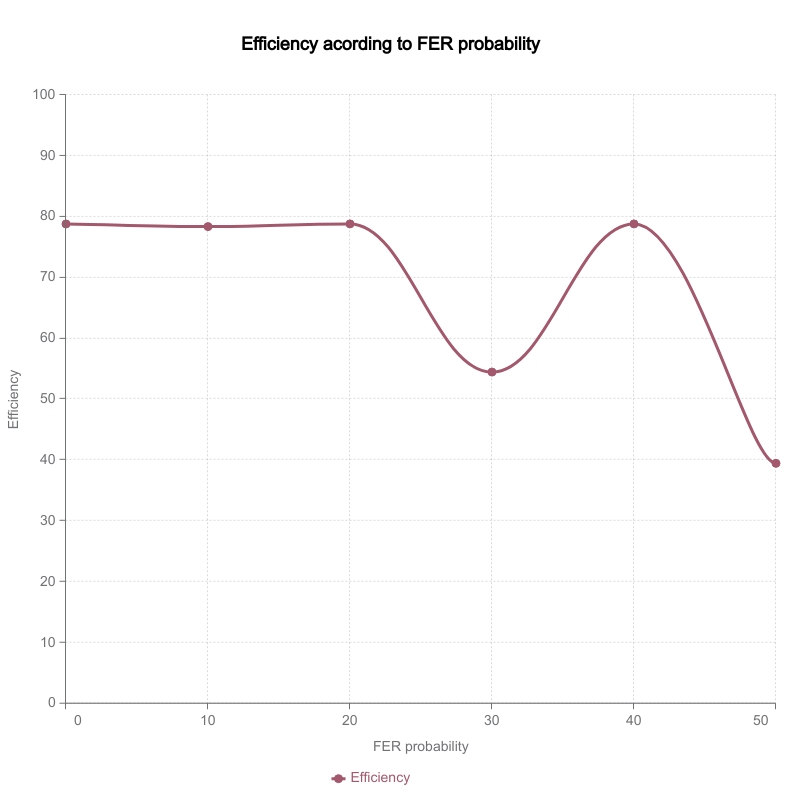

# Redes de Computadores


## Protocolo de Ligação de Dados

*25 de Novembro de 2021*

#### Contributors

- [Tiago Lima Rocha](mailto:up201406679@up.pt)  up201406679
- [Pedro Azevedo](mailto:up201603816@up.pt) up201603816
- []

## Table of Contents

- [Redes de Computadores](#redes-de-computadores)
  - [Protocolo de Ligação de Dados](#protocolo-de-ligação-de-dados)
      - [Contributors](#contributors)
  - [Table of Contents](#table-of-contents)
  - [Abstract](#abstract)
  - [Architecture](#architecture)
  - [Code Structure](#code-structure)
  - [Main Use Cases](#main-use-cases)
  - [Link Layer Protocol](#link-layer-protocol)
  - [Data structures for Link Layer](#data-structures-for-link-layer)
  - [Application Layer Protocol](#application-layer-protocol)
  - [Data structures for Application Layer](#data-structures-for-application-layer)
  - [Validation](#validation)
  - [Efficiency](#efficiency)
      - [Connection capacity](#connection-capacity)
      - [Data frame size](#data-frame-size)
      - [FER - Frame Error Ratio](#fer---frame-error-ratio)
  - [Conclusions](#conclusions)
  - [Code](#code)
    - [main.c](#mainc)
    - [types.h](#typesh)
    - [macros.h](#macrosh)
    - [utils.h and utils.c](#utilsh-and-utilsc)
    - [HashMap.h and HashMap.c](#hashmaph-and-hashmapc)
    - [LinkedList.h and LinkedList.c](#linkedlisth-and-linkedlistc)
    - [ByteBuffer.h and ByteBuffer.c](#bytebufferh-and-bytebufferc)
    - [ApplicationLayer.h and ApplicationLayer.c](#applicationlayerh-and-applicationlayerc)
    - [LinkLayer.c and LinkLayer.h](#linklayerc-and-linklayerh)

## Abstract

In this report we explain our approach and results for the very first lab project in the course Computer Networks. The project consists in the transmission of files using the serial port.

The final goal of this project was to develop and test a low level application for file transfering through a serial port making use of 2 independent layers: the link layer and the application layer.

**Keywords:** *framing*, *frame syncronization*, *transparency*, *functional blocks and interfaces used in the architecture*, *API, data structures and methods*, *byte stuffing and destuffing*, *Stop-and-Wait*, *Go-back-N*, *Selective Repeat*, *flux control*, *project use cases and function call sequences*, *functional aspects and strategies implemented in the link and application layers*, *measurement and analysis of the protocol's efficiency*

## Architecture

There are 2 fundamental and independent functional blocks in this project: the **data link** block and the **application** block.

The **data link** block has as a goal open up and close down the connection, as well as assuring a correct transmission of all the frames, and recover them when transmission errors occur. This block has a very low level and communicates directly with the serial port.

The **application** block has as a goal to read and write files, manage data frame sizes and assure that all received data is valid. This block has a higher level and makes use of the middleware API defined in the data link block.

Memory management in both these blocks happens with the use of a **dynamic array**.

The program's **CLI** allows the use of the same executable for both reception and transmission of files by specifying the option in the comand line. Besides that it is necessary to specify the name or path of the file we want to transmit/receive as well as the name of the serial port we want to use for either operation. Moreover, **baudrate**, **max frame size**, **max transmission tries** and **timeout in seconds** are optional parameters in this interface. When the program finishes executing, transmission statistics are shown in the standard output.

## Code Structure

## Main Use Cases

The **link layer** will have as main use cases to allow for an application to connect a serial port (through **ll_open**), send or receive data framents (**ll_read** and **ll_write**), and shut down the connection (**ll_close**). Moreover it showcases the statistics about the connection itself, in this case total frames sent and frames lost. This layer can be configured with the use of **ll_setup**, making it possible to change the *baudrate*, *max number of tries* and *timout* limit for the transmission.

The **application layer** has  two main use cases: send a file (**al_send_file**, which also uses **ll_write** in its implementation) or receive a file (**al_receive_file**, which uses **ll_read** in its implementaion), and both these methods make use of the functions **ll_open**, **ll_close** form the link layer. This layer can be configured using **al_setup** in which it's possible to change the *max data fragment size*. It also displays the inforation about *average bits per second*, *number of data packets sent*, *transmission duration* and *efficiency*.

## Link Layer Protocol

The data link protocol begins its flow with the **ll_open** method which starts by opening a connection with the serial port using the supplied configurations. After establishing a connection, the receptor end waits for the transmitter to send a control frame **SET**, and this makes the latter wait for a **UA** control frame response to acknowledge the connection.

```C
/**
* @brief Opens the connection to the serial port and begins the setup protocol for file transmission
*
* @param port: serial port number
* @param type: if the app transmits or receives data
*
* @return int APP_ERROR_GENERAL in case of error or the serial port descriptor in case of success
*
*/
int ll_open(int port, LinkType type);
```

After this communication occurs it is then possible to transmit information frames using **ll_write** and **ll_read**. In the **ll_write** function hte header of the data frame is firstly created, and then the data fragments are introduced in the frame on a per byte basis. Simultaneously, the **BCC2** security byte is calculated which gives place for the **byte stuffing** mechanism to take place. Finally, the program verifies if **BCC2** needs **byte stufffing** and introduces it in the frame. When the frame is complete, it is then sent through the serial port, and a response containing the **RR** control frame is awaited. If that response takes longer than the stipulated limit timeframe, or the **RR** frame is a double or if the response is actually a **REJ** frame, a re-transmission must now take place. If the re-transmission limit is surpassed, the operation aborts.

In the **ll_read** method we await for a data frame. When said frame arrives, the header must be validated and the data is read byte by byte, using a technique called **byte destuffing** when necessary and calculating the expected **BCC2**. After this process, the **BCC2** is read and compared with the expected one previously calculated. If they match an **RR** control frame is sent. Otherwise, if a problem occurs a control framewith control field **REJ** is sent instead.

```C
/**
* @brief Sends a frame through the serial port
*
* @param fd: serial port file descriptor 
* @param buffer: file partition to send
* @param length: size of the file partition
*
* @return  returns APP_ERROR_GENERAL in case of error or the size of the frame written in case of success
*
*/
int ll_write(int fd, char *buffer, int length);

/**
* @brief Reads an incoming frame from the serial port
*
* @param fd: serial port file descriptor 
* @param buffer: buffer to store the data of the frame
*
* @return int APP_ERROR_GENERAL in case of error or the size of the frame read in case of success
*/
int ll_read(int fd, char **buffer);
```

Last but not least, in **ll_close** the transmitter sends a control frame with control field **DISC** and the receptor must respond with **DISC** as well. At this point the transmitter sends a control frame with control field **UA**, shuts down the connection and resets the serial port configuration. The receptor does the same on its end after receiving the **UA** message.

```C
/**
* @brief Begins the disconnection protocol and closes the serial port
*
* @param fd: serial port file descriptor 
*
* @return int APP_ERROR_GENERAL in case of error or the serial port descriptor in case of success
*
*/
int ll_close(int fd);
```

## Data structures for Link Layer

In link layer we make use of **ByteBuffer** which we use to build our packets and read/write them to the serial port.

```C
/** @struct ByteBuffer
 *  @brief This structure is used to create a new empty packet and stuff it with
 *         Bytes
 * 
 *  @var ByteBuffer::buffer 
 *  Member 'buffer' contains the byte array
 *  @var ByteBuffer::size
 *  Member 'size' contains the current size of the packet
 *  @var ByteBuffer::capacity
 *  Member 'capacity' contains the total capacity of the packet
 */
struct ByteBuffer
{
  unsigned char *buffer;
  unsigned int size;
  unsigned int capacity;
};
```

We also keep track of number of the number of frames received and number of frames dropped with the struct **llInfo**.

```C
/** @struct llInfo
 *  @brief This structure is used to store information about the link layer during the transmission process
 * 
 *  @var llInfo::framesTotal 
 *  Member 'framesTotal' contains the total amount of frames in the link layer
 *  @var llInfo::framesLost
 *  Member 'framesLost' contains the amount of lost frames in the link layer
 */
struct llInfo
{
  unsigned int framesTotal;
  unsigned int framesLost;
};
```

Finally we use a **LinkLayer** struct to store the configuration of the serial port.

```C
/** @struct LinkLayer
 *  @brief This structure is used to sinalize the beggining and end of file transfer
 * 
 *  @var LinkLayer::port 
 *  Member 'port' contains the serial port used
 *  @var LinkLayer::baudrate
 *  Member 'baudrate' speed of the communication channel
 *  @var LinkLayer::timeout
 *  Member 'timeout' max time to receive response 
 *  @var LinkLayer::transmissionsNo
 *  Member 'transmissionsNo' max frame size
 * 
 */
struct LinkLayer
{
  char port[MAX_PORT_LENGTH];
  int baudrate;
  unsigned int sequenceNo;
  unsigned int timeout;
  unsigned int transmissionsNo;
};
```

## Application Layer Protocol

The application protocol has a higher level and uses the middleware API from the data link to make file transfers. This layer can be represented by two fundamental methods: **al_receive_file** and **al_send_file**. Both these methods initialize and close the connection by the end of their flow.

The **al_send_file** method reads the file and sends a control packet to commence the transmission. Afterwards, for each data fragment, it is created a data package which includes the file name or path, package sequence number, segment size and the actual segment data using the function **ll_write** from the link layer. When all fragments are sent another control package is sent to sinalize the end of transmission.

The **al_receive_file** function makes use of **ll_read** to read these packets. While it receives the packets, this method saves the data fragments in a file until it receives the control packet that symbolizes the end of the operation. This function validates the packets sequence numbers and, at the end, if it received the right quantity of bytes.

```C
/**
 * @brief Opens a connections and proceeds with the file transfering flow. 
 *        Closes when file finished transfering.
 *        It first reads the file and then sends a control packet to sinalize 
 *        the beggining of the transfer. Then for each data fragment a data packet is
 *        built which includes the filename, sequence number, fragment size, and fragment
 *        data using the ll_write method from the Link Layer. When all fragments are sent, 
 *        another control packet is sent to mark the transfer ending.
 * @param filename name/path of the file to transfer
 * @param port port in which the transfer takes place
 * @return Return 0 if success
 */
int al_send_file(const char *filename, int port);

/**
 * @brief Opens a connections and proceeds with the file receiving flow. 
 *        Closes when file is received.
 *        Uses the ll_read method from Link Layer to read the transmitted data packets.
 *        While it receives new packets, the funciton stores the data fragments in a file
 *        until it receives the control packet marking the end of transmission. This method
 *        validates the packet sequence numbers and, at the end, if it has received the 
 *        proper amount of bytes.
 * @param filename name/path of the file to transfer
 * @param port port in which the transfer takes place
 * @return Return 0 if success
 */
int al_receive_file(const char *filename, int port);
```

This layer also outputs transmission information.

## Data structures for Application Layer

For the application layer we use 2 types of structures to build packets to build and send/receive. One for control packets (**ControlPacket**) and one for data packets (**DataPacket**).

```C
/** @struct ControlPacket
 *  @brief This structure is used to sinalize the beggining and end of file transfer
 * 
 *  @var ControlPacket::type 
 *  Member 'type' Byte that contains the type of the control packet (start, end or data)
 *  @var ControlPacket::nameLength 
 *  Member 'nameLength' Byte that contains the length of the value
 *  @var ControlPacket::size 
 *  Member 'size' contains the size of the packet
 *  @var ControlPacket::sizeLength 
 *  Member 'sizeLength' contains the length of the size
 */
struct ControlPacket
{
  alControlType type;
  char *name;
  int8_t nameLength;
  uint32_t size;
  uint8_t sizeLength;
};

/** @struct DataPacket
 *  @brief This structure contains fragments of the file to transmit
 * 
 *  @var DataPacket::type 
 *  Member 'type' Byte that contains the type of the control field (1 for data)
 *  @var DataPacket::sequenceNo
 *  Member 'sequenceNo' contains the sequence number (mod 255)
 *  @var DataPacket::size 
 *  Member 'size' contains the number of Bytes in the data field
 *  @var DataPacket::data
 *  Member 'data' contains the data of the packet in Bytes
 */
struct DataPacket
{
  alControlType type;
  int8_t sequenceNo;
  uint16_t size;
  char *data;
};
```

Similarly to the link layer, we use **alInfo** for the application layer, however it stores additional data such as, **transmission duration**, **number retransmissions**, etc.

```C
/** @struct alInfo
 *  @brief This structure is used to store information about the application layer during the transmission process
 * 
 *  @var alInfo::baudrate 
 *  Member 'baudrate' contains the rate at which information is transferred in a communication channel (b/s) 
 *  @var alInfo::timeout
 *  Member 'timeout' contains the timeout in seconds
 *  @var alInfo::retries 
 *  Member 'retries' contains the number of retries done
 *  @var alInfo::avgBitsPerSecond
 *  Member 'avgBitsPerSecond' contains the average bit transfer per each second
 *  @var alInfo::dataPacketCount
 *  Member 'dataPacketCount' contains the number of data packets sent
 *  @var alInfo::fileSize 
 *  Member 'fileSize' contains the total size of the file in Bytes
 *  @var alInfo::framesTotal
 *  Member 'framesTotal' contains the total amount of frames parsed
 *  @var alInfo::framesLost
 *  Member 'framesLost' contains the total amount of frames lost
 *  @var alInfo::transmissionDurationSecs
 *  Member 'transmissionDurationSecs' contains the total duration of the transmission process in seconds
 */
struct alInfo
{
  unsigned int baudrate;
  unsigned int timeout;
  unsigned int retries;
  unsigned int avgBitsPerSecond;
  unsigned int dataPacketCount;
  unsigned int fileSize;
  unsigned int framesTotal;
  unsigned int framesLost;
  double transmissionDurationSecs;
};
```

## Validation

The following test scenarios were implemented in this project:

- Transmission of files with different sizes
- Interruption of the connection at random moments during transmission (partially)
- Introduction of random bits during transmission
- Simulation of erros in the BCC2 field of the data packets
- Variation of multiple application parameters such as *baudrate*, *max number of retries*, *timeout* and *frame size*.

## Data

The following graphs were made when transmitting **pinguim.gif** in the lab by changing the FERPROB and defining FER, macros we defined so that the receiver would reject random Packets.

| FERPROB  |  Baudrate (bits/s) | Retransmissions  | Total Time (s)  | Fragment Size  | Received BitRate (bits/s)  | Efficiency  |
|---|---|---|---|---|---|---|
| 0%  | 38400  | 0  | 2.90  | 6048  | 30263  | 78.81%   |
| 10%  | 38400   | 0  | 2.92  | 6048  | 30099  | 78.38%  |
| 20%  |  38400  | 0  | 2.90  | 6048  | 30269  | 78.82%  |
| 30%  | 38400   |  1 |  4.19 |  6048 | 20921  |  54.48% |
| 40%  | 38400   | 0  | 2.90  | 6048  |  30269 | 78.82%  |
| 50%  | 38400   | 2  | 5.79  |  6048 | 15166  | 39.49  |



As we can observe when the FER probability is 40% the efficency goes up again, this however can be explained due to the fact that to transmit the entire file it requires very packets and that the decision of sending the REJ is entirely dependent on random number generation.

## Conclusions

In this report we describe the implementation of our protocol, the functions we implemented, the tests we made and finaly the results of those same tests. Our project was sucessfully implemented with most packet syncronization, verification and recovery protocols.
In terms of efficiency, file transmission with no interferance is on average 78%, however when we try to transmit larger files the same thing can not be said,as we noticed slight delays when transmitting.
In terms of robusteness, aside from some issues of retransmission which may or may not work depending of number of interrupts, we can affirm that our program can handle all other issues that can arise.
In conclusion, we belive we succeded in implementing most of the protocols, however if we could we would have tried even further to fix the aformentioned issues.

## Code

### main.c

```C
#include "lib/utils/utils.h"
#include "lib/macros.h"
#include "lib/types.h"
#include "api/ApplicationLayer/ApplicationLayer.h"
#include "api/LinkLayer/LinkLayer.h"

int main(int argc, char **argv)
{
  if (argc < 4)
  {

    logger(ERROR, APP_ERROR_USAGE);
    print_usage(argv[0]);

    return EXIT_FAILURE;
  }
  srand(time(0));

  char *filename = argv[1];

  LinkType type = RECEIVER;
  if (argv[2][0] == 'T')
    type = TRANSMITTER;

  int port = atoi(argv[3]);

  /* Options */
  int timeout = DEFAULT_TIMEOUT_DURATION;
  int retries = DEFAULT_MAX_TRANSMISSION_ATTEMPS;
  int baudrate = DEFAULT_BAUDRATE;
  int fragSize = MAX_FRAGMENT_SIZE;

  for (int i = 4; i < argc; ++i)
  {

    if (!strncmp(argv[i], "-timeout=", 9) && strlen(argv[i]) > 9)
    {
      timeout = atoi(&argv[i][9]);
      continue;
    }

    if (!strncmp(argv[i], "-max_retries=", 13) && strlen(argv[i]) > 13)
    {
      retries = atoi(&argv[i][13]);
      continue;
    }

    if (!strncmp(argv[i], "-baudrate=", 10) && strlen(argv[i]) > 10)
    {
      baudrate = atoi(&argv[i][10]);
      continue;
    }

    if (!strncmp(argv[i], "-fragSize=", 10) && strlen(argv[i]) > 11)
    {
      fragSize = atoi(&argv[i][10]);
      continue;
    }
  }

  printf("timeout=%d\nretries=%d\nbaudrate=%d\nfragSize=%d\n", timeout, retries, baudrate, fragSize);
  al_setup(timeout, baudrate, retries, fragSize);

  int res;
  if (type == RECEIVER)
    res = al_receive_file(filename, port);
  else
    res = al_send_file(filename, port);

  if (res >= 0)
    al_print_info();

  return EXIT_SUCCESS;
}
```

### types.h

```C
#pragma once

#include <stdint.h>
#include "macros.h"

typedef unsigned char uchar_t;

typedef struct ControlPacket ControlPacket;
typedef struct DataPacket DataPacket;
typedef struct alInfo alInfo;
typedef struct llInfo llInfo;
typedef struct LinkLayer LinkLayer;

/// alControlType enum to determine the control type of the control field for the application layer
typedef enum alControlType
{
  CONTROL_START = 0x02, /**!< Start of transmisison */
  CONTROL_END = 0x03,   /**!< End of transmission */
  CONTROL_DATA = 0x01   /**!< Ongoing Transmission */
} alControlType;

/// llControlType enum to determine the control type of the control field for the link layer
typedef enum llControlType
{
  LL_INF = 0x00,  /**!< Info */
  LL_SET = 0x03,  /**!< Setup */
  LL_DISC = 0x0B, /**!< Disconnect */
  LL_UA = 0x07,   /**!< Unnumbered acknowledgment */
  LL_RR = 0x05,   /**!< Receiver ready / positive ACk */
  LL_REJ = 0x01   /**!< Reject / negative ACK */
} llControlType;

/// LinkType enum to determine te type of link to be made
typedef enum LinkType
{
  TRANSMITTER = 0x00, /**!< Determines transmitter flow */
  RECEIVER = 0x01,    /**!< Determines reveiver flow */
} LinkType;

/// llControlFrameField enum to determine the control frame field to be used
typedef enum llControlFrameField
{
  FD_FIELD = 0x00,   /**!< Start Flag field */
  AF_FIELD = 0x01,   /**!< Address field */
  C_FIELD = 0x02,    /**!< Control field */
  BCC1_FIELD = 0x03, /**!< BCC1 field */
  DATA_FIELD = 0x04, /**!< Data field start field */
} llControlFrameField;

/// LogType enum for representing the type of logging produced by the logger
typedef enum LogType
{
  INFO,  /**!< Information */
  WARN,  /**!< Warnings */
  ERROR, /**!< Errors */
} LogType;

/// LogCode enum used to manufacture new logs in the log factory
typedef enum LogCode
{
  APP_ERROR_USAGE = 1,                                  /**!< Error for bad app usage */
  BB_ERROR_CREATE = 2,                                  /**!< Error for Byte Buffer creation */
  BB_ERROR_PUSH = 3,                                    /**!< Error for Byte Buffer stuffing */
  BB_ERROR_REMOVE = 4,                                  /**!< Error for  */
  BB_WARN_PRINT_EMPTY = 5,                              /**!< Warning for Byte Buffer empty print */
  BB_WARN_FREE_EMPTY = 6,                               /**!< Warning for Byte Buffer empty free */
  LL_INFO_CLOSE_DISCONECT = 7,                          /**!< Info for Link Layer disconnection */
  LL_ERROR_CLOSE_DISCONECT = -8,                        /**!< Error for Link Layer disconnection */
  LL_WARN_CLOSE_FRAME_IGNORED = 9,                      /**!< Warning for Link Layer ignored close frame */
  LL_ERROR_WRITE_FAIL = -10,                            /**!< Error for Link Layer write failure */
  LL_WARN_READ_FRAME_IGNORED_SET = 11,                  /**!< Warning for Link Layer ignored settup fram */
  LL_WARN_READ_FRAME_IGNORED_CONTROL = 12,              /**!< Warning for Link Layer inored control frame */
  LL_WARN_READ_FRAME_IGNORED_DUPLICATE = 13,            /**!< Warning Link Layer ignored duplicate frame */
  LL_INFO_OPEN_CONNECT = 14,                            /**!< Info for Link Layer new connection opened */
  LL_INFO_OPEN_RECEIVER_WAITING = 15,                   /**!< Info for Link Layer reciever ready */
  LL_WARN_OPEN_RECEIVER_FRAME_IGNORED = 16,             /**!< Warning for Link Layer reciever frame ignored */
  LL_ERROR_OPEN_RECEIVER_UA_PACKET_SEND = -17,          /**!< Error for Link Layer UA packet not sent */
  LL_WARN_FRAME_EXCHANGE_TIMEOUT_OR_INVALID_FRAME = 18, /**!< Warning for Link Layer invalid frame or timeout during exchange */
  LL_WARN_FRAME_EXCHANGE_FRAME_IGNORED_DUPLICATE = 19,  /**!< Warning for Link Layer ignored duplicate frame during exchange */
  LL_WARN_FRAME_EXCHANGE_FRAME_REJECTED = 20,           /**!< Warning for Link Layer rejected frame during exchange */
  LL_WARN_FRAME_EXCHANGE_FRAME_IGNORED_CONTROL = 21,    /**!< Warning for Link Layer ignored control frame during exchange */
  LL_ERROR_FRAME_EXCHANGE_ATTEMPTS_EXCEEDED = -22,      /**!< Error for Link Layer exchange attempts exceeded */
  LL_ERROR_SEND_FRAME_WRITE_TO_PORT = -23,              /**!< Error for Link Layer could not write to port during sending */
  LL_ERROR_READ_FRAME_IGNORED = -24,                    /**!< Error for Link Layer ignored frame error during read */
  LL_ERROR_VALIDATE_CONTROL_FRAME_NULL = -25,           /**!< Error for Link Layer NULL control frame, cannot validate */
  APP_ERROR_GENERAL = -1,                               /**!< Error for application general failures */
  LL_ERROR_FRAME_TOO_SMALL = -2,                        /**!< Error for Link Layer frame too small */
  LL_ERROR_BAD_START_FLAG = -3,                         /**!< Error for Link Layer bad start flag */
  LL_ERROR_BAD_ADDRESS = -4,                            /**!< Error for Link Layer bad address */
  LL_ERROR_BAD_BCC1 = -5,                               /**!< Error for Link Layer bad BCC1 */
  LL_ERROR_BAD_END_FLAG = -6,                           /**!< Error for Link Layer bad end flag */
  LL_WARN_SIG_CONNECTION_TIMED_OUT = -7,                /**!< Warning for Link Layer signal connection timed out */
  AL_ERROR_SEND_FILE_NAME_LENGTH = -26,                 /**!< Error for Application Layer exceeded name length while sending file */
  AL_ERROR_SEND_FILE_OPEN = -27,                        /**!< Error for Application Layer error opening file while sending */
  AL_ERROR_SEND_FILE_CONNECTION = -28,                  /**!< Error for Application Layer could not connect while sending */
  AL_ERROR_SEND_FILE_TRANSMISSION = -29,                /**!< Error for Application Layer bad transmission while sending */
  AL_INFO_SEND_FILE_TRANSMISSION_DONE = 30,             /**!< Info for Application Layer transmisison done */
  AL_INFO_RECEIVE_FILE_WAITING_CONNECTION = 31,         /**!< Info for Application Layer waiting connection */
  AL_WARN_RECEIVE_FILE_DATA_PACKET_IGNORE = 32,         /**!< Warning for Application Layer ignored data packet */
  AL_INFO_RECEIVE_FILE_TRANSMISSION_OVER = 33,          /**!< Info for Application Layer transmisison over */
  AL_ERROR_RECEIVE_FILE_CONNECTION = -34,               /**!< Error for Application Layer connection error while receiving */
  AL_ERROR_RECEIVE_FILE_WRITE = -35,                    /**!< Error for Application Layer file writting error while receiving */
  AL_INFO_RECEIVE_FILE_STARTING_TRANSMISSION = 36,      /**!< Info for Application Layer starting new transmisison */
  AL_ERROR_READ_DATA_PACKET = -37,                      /**!< Error for Application Layer reading data packet */
  AL_ERROR_READ_DATA_PACKET_CONTROL_PACKET = -38,       /**!< Error for Application Layer reading control packet */
  AL_ERROR_SEND_CONTROL_PACKET = -39,                   /**!< Error for Application Layer sending control packet */
  AL_INFO_SEND_CONTROL_PACKET = 40,                     /**!< Info for Application Layer control packet sent */
  AL_ERROR_READ_CONTROL_PACKET_RECEIVE_PACKET = -41,    /**!< Error for Application Layer receiving control packet */
  AL_ERROR_PARSE_CONTROL_PACKET_INVALID_PACKET = -42,   /**!< Error for Application Layer invalid control packet cannot be parsed */
  AL_INFO_SEND_FILE_TRANSMISSION_START = 43,            /**!< Info for Application Layer starting file sending transmission */
} LogCode;

/** @struct ControlPacket
 *  @brief This structure is used to sinalize the beggining and end of file transfer
 * 
 *  @var ControlPacket::type 
 *  Member 'type' Byte that contains the type of the control packet (start, end or data)
 *  @var ControlPacket::nameLength 
 *  Member 'nameLength' Byte that contains the length of the value
 *  @var ControlPacket::size 
 *  Member 'size' contains the size of the packet
 *  @var ControlPacket::sizeLength 
 *  Member 'sizeLength' contains the length of the size
 */
struct ControlPacket
{
  alControlType type;
  char *name;
  int8_t nameLength;
  uint32_t size;
  uint8_t sizeLength;
};

/** @struct DataPacket
 *  @brief This structure contains fragments of the file to transmit
 * 
 *  @var DataPacket::type 
 *  Member 'type' Byte that contains the type of the control field (1 for data)
 *  @var DataPacket::sequenceNo
 *  Member 'sequenceNo' contains the sequence number (mod 255)
 *  @var DataPacket::size 
 *  Member 'size' contains the number of Bytes in the data field
 *  @var DataPacket::data
 *  Member 'data' contains the data of the packet in Bytes
 */
struct DataPacket
{
  alControlType type;
  int8_t sequenceNo;
  uint16_t size;
  char *data;
};

/** @struct alInfo
 *  @brief This structure is used to store information about the application layer during the transmission process
 * 
 *  @var alInfo::baudrate 
 *  Member 'baudrate' contains the rate at which information is transferred in a communication channel (b/s) 
 *  @var alInfo::timeout
 *  Member 'timeout' contains the timeout in seconds
 *  @var alInfo::retries 
 *  Member 'retries' contains the number of retries done
 *  @var alInfo::avgBitsPerSecond
 *  Member 'avgBitsPerSecond' contains the average bit transfer per each second
 *  @var alInfo::dataPacketCount
 *  Member 'dataPacketCount' contains the number of data packets sent
 *  @var alInfo::fileSize 
 *  Member 'fileSize' contains the total size of the file in Bytes
 *  @var alInfo::framesTotal
 *  Member 'framesTotal' contains the total amount of frames parsed
 *  @var alInfo::framesLost
 *  Member 'framesLost' contains the total amount of frames lost
 *  @var alInfo::transmissionDurationSecs
 *  Member 'transmissionDurationSecs' contains the total duration of the transmission process in seconds
 */
struct alInfo
{
  unsigned int baudrate;
  unsigned int timeout;
  unsigned int retries;
  unsigned int avgBitsPerSecond;
  unsigned int dataPacketCount;
  unsigned int fileSize;
  unsigned int framesTotal;
  unsigned int framesLost;
  double transmissionDurationSecs;
};

/** @struct llInfo
 *  @brief This structure is used to store information about the link layer during the transmission process
 * 
 *  @var llInfo::framesTotal 
 *  Member 'framesTotal' contains the total amount of frames in the link layer
 *  @var llInfo::framesLost
 *  Member 'framesLost' contains the amount of lost frames in the link layer
 */
struct llInfo
{
  unsigned int framesTotal;
  unsigned int framesLost;
};

/** @struct LinkLayer
 *  @brief This structure is used to sinalize the beggining and end of file transfer
 * 
 *  @var LinkLayer::port 
 *  Member 'port' contains the serial port used
 *  @var LinkLayer::baudrate
 *  Member 'baudrate' speed of the communication channel
 *  @var LinkLayer::timeout
 *  Member 'timeout' max time to receive response 
 *  @var LinkLayer::transmissionsNo
 *  Member 'transmissionsNo' max frame size
 * 
 */
struct LinkLayer
{
  char port[MAX_PORT_LENGTH];
  int baudrate;
  unsigned int sequenceNo;
  unsigned int timeout;
  unsigned int transmissionsNo;
};
```

### macros.h

```C
#pragma once

/** @defgroup macros
 * @{
 *
 * Constants for programming the many layers of the API.
 */

// Options
#define HT_CAPACITY 50000 /**< @brief Hash map max memory allocation size in Bytes */
#define BUFFER 6042       /**< @brief String buffer max memory allocation size in Bytes */

#define DEFAULT_MAX_TRANSMISSION_ATTEMPS 3 /**!< @brief Default value for maximum transmisison attempts  */
#define DEFAULT_TIMEOUT_DURATION 3         /**!< @brief Default value for timeout duration in seconds  */
#define DEFAULT_BAUDRATE 38400             /**!< @brief Default rate at which information is transferred in a communication channel (b/s) */

// Application Layer
#define MAX_FRAGMENT_SIZE 0xFFFF /**!< @brief Maximum value for the chunk fragment size to be transferd */
#define MAX_BAUDRATE 460800      /**!< @brief Maximum rate at which information is transferred in a communication channel (b/s)  */
#define DATA_HEADER_SIZE 4       /**!< @brief Size in Bytes of the header of the package */
#define MAX_FILE_NAME 256        /**!< @brief Maximum length of the filename string in chars (Bytes) */

#define CP_CFIELD 0x00 /**!< @brief Control package control field */
#define SEQ_FIELD 0x01 /**!< @brief Sequence number field */
#define L2_FIELD 0x02  /**!< @brief TLV Byte for length in Bytes of the value field */
#define L1_FIELD 0x03  /**!< @brief TLV Byte for length in Bytes of the value field */

#define TLV_SIZE_T 0x00 /**!< @brief TLV Byte for file size */
#define TLV_NAME_T 0x01 /**!< @brief TLV Byte for file name */
#define CP_MIN_SIZE 7   /**!< @brief Minimum size in Bytes of the Control Packet */

#define AL_LOG_INFORMATION /**!< @brief Feature flag to log App layer info */
// #define AL_PRINT_CPACKETS /**!< @brief Feature flag to log control packets read */

// Link Layer
#define LL_FLAG 0x7E    /**!< @brief Flag for beggining and ending of frame  */
#define LL_ESC 0x7D     /**!< @brief PPP escape mechanism character for byte stuffing */
#define LL_ESC_MOD 0x20 /**!< @brief Stuffing byte  */
#define LL_AF1 0x03     /**!< @brief Transmitter commands, Receiver replys  */
#define LL_AF2 0x01     /**!< @brief Transmitter replys, Receiver commands  */

#define FERPROB 20 /**!< @brief File error predefined probability for testing purposes */
#define FER        /**!< @brief Feature flag for FER testing */

#define _POSIX_SOURCE 1 /**!< @brief POSIX compliant source  */

#define INF_FRAME_SIZE 6     /**!< @brief Size in Bytes of the I frames */
#define CONTROL_FRAME_SIZE 5 /**!< @brief Size in Bytes of the control frame */
#define MAX_PORT_LENGTH 20   /**!< @brief Maximum length in Bytes of the port buffer */

#define MAX_TRANSMISSION_ATTEMPS 3 /**!< @brief Maximum number of transmission attempts before timeout */
#define TIMEOUT_DURATION 3         /**!< @brief Timeout duration in seconds */

// Port name prefix
#ifdef __linux__
#define PORT_NAME "/dev/ttyS" /**!< @brief Port description for linux systems */
#elif _WIN32
#define PORT_NAME "COM" /**!< @brief Port description for windows systems */
#else
#define PORT_NAME "/dev/ttyS"
#endif
```

### utils.h and utils.c

```C
#pragma once

#include <stdio.h>
#include <stdlib.h>
#include <unistd.h>
#include <string.h>
#include <sys/time.h>
#include <time.h>
#include <limits.h>
#include <termios.h>

#include "../types.h"
#include "../macros.h"
#include "../HashMap/HashMap.h"

const char *get_filename_ext(const char *filename);
char *remove_filename_ext(char *myStr);
char *my_itoa(const int value, const int bufferSize);
void print_usage(const char *arg);
void print_progress(int done, int total);
int write_to_file(char *filePath, char *msg);
int send_raw_data(int fd, char *buffer, int length);
float clock_seconds_since(struct timeval *startTimer);
char *timestamp();
int logger(LogType type, LogCode code);
int get_termios_baudrate(int baudrate);
```

```C
#include "utils.h"

char *remove_filename_ext(char *myStr)
{
  char *retStr;
  char *lastExt;

  if (myStr == NULL)
    return NULL;

  if ((retStr = malloc(strlen(myStr) + 1)) == NULL)
    return NULL;

  strcpy(retStr, myStr);
  lastExt = strrchr(retStr, '.');

  if (lastExt != NULL)
    *lastExt = '\0';

  return retStr;
}

const char *get_filename_ext(const char *filename)
{
  const char *dot = strrchr(filename, '.');
  if (!dot || dot == filename)
    return "";
  return dot + 1;
}

char *my_itoa(const int value, const int bufferSize)
{
  char *str = malloc(sizeof(char) * bufferSize);
  sprintf(str, "%d", value);
  return str;
}

int write_to_file(char *filePath, char *msg)
{
  FILE *f = fopen(filePath, "a");

  if (f == NULL)
  {
    perror("Error in write_to_file");
    exit(EXIT_FAILURE);
  }

  fprintf(f, "%s\n", msg);
  fclose(f);

  return EXIT_SUCCESS;
}

void print_progress(int done, int total)
{
  float percent = ((float)done / (float)total) * 100.0f;
  int blocks = percent / 10;

  printf("\rProgress ");
  for (int i = 0; i < blocks; ++i)
  {
    printf("#");
  }
  printf("[%.2f]", percent);
  fflush(stdout);
}

void print_usage(const char *arg)
{
  printf("Usage:\n");
  printf("%s <file_name> <T|R> <port_number> [options]\n", arg);
  printf("\nT - Transmitter, R - Receiver\n");
  printf("\nOptions:\n");
  printf("  -timeout=<seconds> \t\tSeconds until a frame is timed out\n");
  printf("  -baudrate=<rate> \t\tSerial port rate\n");
  printf(
      "  -max_retries=<retries> \tTimes a frame transmission can be "
      "retried\n");
  printf("  -fragSize=<size> \t\tMax size for data fragments\n");
  printf("\nExample: '%s static/pinguim.gif T 10'\n", arg);
}

int send_raw_data(int fd, char *buffer, int length)
{
  return write(fd, buffer, length);
}

float clock_seconds_since(struct timeval *startTimer)
{
  struct timeval endTimer;
  gettimeofday(&endTimer, NULL);
  float elapsed = (endTimer.tv_sec - startTimer->tv_sec);
  elapsed += (endTimer.tv_usec - startTimer->tv_usec) / 1000000.0f;
  return elapsed;
}

char *timestamp()
{
  time_t currentTime;
  char *cTimeString;

  /* Obtain current time. */
  currentTime = time(NULL);

  if (currentTime == ((time_t)-1))
  {
    (void)fprintf(stderr, "Failure to obtain the current time.\n");
    exit(EXIT_FAILURE);
  }

  /* Convert to local time format. */
  cTimeString = ctime(&currentTime);

  if (cTimeString == NULL)
  {
    (void)fprintf(stderr, "Failure to convert the current time.\n");
    exit(EXIT_FAILURE);
  }

  return cTimeString;
}

int logger(LogType type, LogCode code)
{

  char log[BUFFER], typeStr[32], codeStr[32], pathToTracefile[BUFFER];

  HashTable *logTypes = create_table(HT_CAPACITY);
  HashTable *logMessages = create_table(HT_CAPACITY);

  ht_insert(logTypes, "0", "INFO");
  ht_insert(logTypes, "1", "WARN");
  ht_insert(logTypes, "2", "ERROR");

  ht_insert(logMessages, "-1", "app.general.error");
  ht_insert(logMessages, "1", "app.usage.error");
  ht_insert(logMessages, "2", "bb.create.error");
  ht_insert(logMessages, "3", "bb.push.error");
  ht_insert(logMessages, "4", "bb.remove.error");
  ht_insert(logMessages, "5", "bb.print.empty.warn");
  ht_insert(logMessages, "6", "bb.free.empty.warn");
  ht_insert(logMessages, "7", "ll.close.disconect.info");
  ht_insert(logMessages, "-8", "ll.close.communicate_disconect.error");
  ht_insert(logMessages, "9", "ll.close.frame_ignored.warn");
  ht_insert(logMessages, "-10", "ll.write.error");
  ht_insert(logMessages, "11", "ll.read.frame_ignored.unexpected_SET_control.warn");
  ht_insert(logMessages, "12", "ll.read.frame_ignored.unexpected_control_field.warn");
  ht_insert(logMessages, "13", "ll.read.frame_ignored.duplicate_frame.warn");
  ht_insert(logMessages, "14", "ll.open.connect.info");
  ht_insert(logMessages, "15", "ll.open_receiver.waiting_for_connection.info");
  ht_insert(logMessages, "16", "ll.open_receiver.frame_ignored.unexpected_control_field.warn");
  ht_insert(logMessages, "-17", "ll.open_receiver.unable_to_send_UA_packet.error");
  ht_insert(logMessages, "18", "ll.frame_exchange.timeout_or_invalid_frame.warn");
  ht_insert(logMessages, "19", "ll.frame_exchange.frame_ignored.duplicate_frame.warn");
  ht_insert(logMessages, "20", "ll.frame_exchange.frame_rejected.warn");
  ht_insert(logMessages, "21", "ll.frame_exchange.frame_ignored.unexpected_control_field.warn");
  ht_insert(logMessages, "-22", "ll.frame_exchange.connection_failed.transmission_attempts_exceeded.error");
  ht_insert(logMessages, "-23", "ll.send_frame.write_frame_to_port.error");
  ht_insert(logMessages, "-24", "ll.read_frame.frame_ignored.header_validation.error");
  ht_insert(logMessages, "-25", "ll.validate_control_frame.null_frame_or_frame_buffer.error");
  ht_insert(logMessages, "-2", "ll.validate_control_frame.frame_too_small.error");
  ht_insert(logMessages, "-3", "ll.validate_control_frame.bad_start_flag.error");
  ht_insert(logMessages, "-4", "ll.validate_control_frame.bad_address.error");
  ht_insert(logMessages, "-5", "ll.validate_control_frame.bad_bcc1.error");
  ht_insert(logMessages, "-6", "ll.validate_control_frame.bad_end_flag.error");
  ht_insert(logMessages, "-7", "ll.sig.connection_timed_out.warn");
  ht_insert(logMessages, "-26", "al.send_file.filename_length_exceeded.error");
  ht_insert(logMessages, "-27", "al.send_file.open_file.error");
  ht_insert(logMessages, "-28", "al.send_file.connection.error");
  ht_insert(logMessages, "-29", "al.send_file.transmission.error");
  ht_insert(logMessages, "30", "al.send_file.file_transmission_done.info");
  ht_insert(logMessages, "31", "al.receive_file.waiting_for_connection.info");
  ht_insert(logMessages, "32", "al.receive_file.ignoring_duplicate_data_packet.warn");
  ht_insert(logMessages, "33", "al.receive_file.file_transmission_over.info");
  ht_insert(logMessages, "-34", "al.receive_file.connection.error");
  ht_insert(logMessages, "-35", "al.receive_file.write_selected_file.error");
  ht_insert(logMessages, "36", "al.receive_file.starting_file_transmission.info");
  ht_insert(logMessages, "-37", "al.read_data_packet.read_packet.error");
  ht_insert(logMessages, "-38", "al.read_data_packet.unexpected_control_packet.error");
  ht_insert(logMessages, "-39", "al.send_control_packet.send_packet.error");
  ht_insert(logMessages, "40", "al.send_control_packet.control_packet_sent.info");
  ht_insert(logMessages, "-41", "al.read_control_packet.failed_to_receive_packet.error");
  ht_insert(logMessages, "-42", "al.parse_control_packet.invalid_control_packet.error");
  ht_insert(logMessages, "43", "al.send_file.starting_file_transmission.info");

  // Cast to string (itoa)
  sprintf(typeStr, "%d", type);
  sprintf(codeStr, "%d", code);

  const char *logType = ht_search(logTypes, typeStr);
  const char *logMessage = ht_search(logMessages, codeStr);
  const char *currTimestamp = timestamp();

  if (getcwd(pathToTracefile, sizeof(pathToTracefile)) == NULL)
  {
    perror("getcwd() error");
    return 1;
  }

  printf("logger: (%s, {type: %s, timestamp: %s})\n\n", logType, logMessage, currTimestamp);
  sprintf(log, "%s - %s - %s", currTimestamp, logType, logMessage);
  strcat(pathToTracefile, "/src/logs/tracefile.txt");
  write_to_file(pathToTracefile, log);

  free_hashtable(logTypes);
  free_hashtable(logMessages);

  return EXIT_SUCCESS;
}

int get_termios_baudrate(int baudrate)
{
  if (baudrate < 0)
    return DEFAULT_BAUDRATE;

  HashTable *baudratesMap = create_table(HT_CAPACITY);

  ht_insert(baudratesMap, "0", my_itoa(B0, 2));
  ht_insert(baudratesMap, "50", my_itoa(B50, 2));
  ht_insert(baudratesMap, "75", my_itoa(B75, 2));
  ht_insert(baudratesMap, "110", my_itoa(B110, 3));
  ht_insert(baudratesMap, "134", my_itoa(B134, 3));
  ht_insert(baudratesMap, "150", my_itoa(B150, 3));
  ht_insert(baudratesMap, "200", my_itoa(B200, 3));
  ht_insert(baudratesMap, "300", my_itoa(B300, 3));
  ht_insert(baudratesMap, "600", my_itoa(B600, 3));
  ht_insert(baudratesMap, "1200", my_itoa(B1200, 4));
  ht_insert(baudratesMap, "1800", my_itoa(B1800, 4));
  ht_insert(baudratesMap, "2400", my_itoa(B2400, 4));
  ht_insert(baudratesMap, "4800", my_itoa(B4800, 4));
  ht_insert(baudratesMap, "9600", my_itoa(B9600, 4));
  ht_insert(baudratesMap, "19200", my_itoa(B19200, 5));
  ht_insert(baudratesMap, "38400", my_itoa(B38400, 5));
  ht_insert(baudratesMap, "57600", my_itoa(B57600, 5));
  ht_insert(baudratesMap, "115200", my_itoa(B115200, 6));
  ht_insert(baudratesMap, "230400", my_itoa(B230400, 6));
  ht_insert(baudratesMap, "460800", my_itoa(B460800, 6));

  char *key = my_itoa(baudrate, 16);
  int termiosBaudrate = atoi(ht_search(baudratesMap, key));
  free_hashtable(baudratesMap);

  return termiosBaudrate;
}
```

### HashMap.h and HashMap.c

```C
#pragma once

#include <stdio.h>
#include <stdlib.h>
#include <string.h>

#include "../LinkedList/LinkedList.h"

typedef struct HashTable HashTable;

struct HashTable
{
  Ht_item **items;
  LinkedList **overflow_buckets;
  int size;
  int count;
};

unsigned long hash_function(char *str);
LinkedList **create_overflow_buckets(HashTable *table);
void free_overflow_buckets(HashTable *table);
Ht_item *create_item(char *key, char *value);
HashTable *create_table(int size);
void free_item(Ht_item *item);
void free_hashtable(HashTable *table);
void handle_collision(HashTable *table, unsigned long index, Ht_item *item);
void ht_insert(HashTable *table, char *key, char *value);
char *ht_search(HashTable *table, char *key);
void ht_delete(HashTable *table, char *key);
void print_search(HashTable *table, char *key);
void print_hashtable(HashTable *table);
```

```C
#include "HashMap.h"
#include "../macros.h"

unsigned long hash_function(char *str)
{
  unsigned long i = 0;
  for (int j = 0; str[j]; j++)
    i += str[j];

  return i % HT_CAPACITY;
}

LinkedList **create_overflow_buckets(HashTable *table)
{
  // Create the overflow buckets; an array of linkedlists
  LinkedList **buckets = (LinkedList **)calloc(table->size, sizeof(LinkedList *));
  for (int i = 0; i < table->size; i++)
    buckets[i] = NULL;

  return buckets;
}

void free_overflow_buckets(HashTable *table)
{
  // Free all the overflow bucket lists
  LinkedList **buckets = table->overflow_buckets;
  for (int i = 0; i < table->size; i++)
    free_linkedlist(buckets[i]);

  free(buckets);
}

Ht_item *create_item(char *key, char *value)
{
  // Creates a pointer to a new hash table item
  Ht_item *item = (Ht_item *)malloc(sizeof(Ht_item));
  item->key = (char *)calloc(strlen(key) + 1, sizeof(char));
  item->value = (char *)calloc(strlen(value) + 1, sizeof(char));

  strcpy(item->key, key);
  strcpy(item->value, value);

  return item;
}

HashTable *create_table(int size)
{
  // Creates a new HashTable
  HashTable *table = (HashTable *)malloc(sizeof(HashTable));

  table->size = size;
  table->count = 0;
  table->items = (Ht_item **)calloc(table->size, sizeof(Ht_item *));

  for (int i = 0; i < table->size; i++)
    table->items[i] = NULL;

  table->overflow_buckets = create_overflow_buckets(table);

  return table;
}

void free_item(Ht_item *item)
{
  // Frees an item
  free(item->key);
  free(item->value);
  free(item);
}

void free_hashtable(HashTable *table)
{
  // Frees the table
  for (int i = 0; i < table->size; i++)
  {
    Ht_item *item = table->items[i];
    if (item != NULL)
      free_item(item);
  }

  free_overflow_buckets(table);
  free(table->items);
  free(table);
}

void handle_collision(HashTable *table, unsigned long index, Ht_item *item)
{
  LinkedList *head = table->overflow_buckets[index];

  if (head == NULL)
  {
    // We need to create the list
    head = allocate_list();
    head->item = item;
    table->overflow_buckets[index] = head;
    return;
  }
  else
  {
    // Insert to the list
    table->overflow_buckets[index] = linkedlist_insert(head, item);
    return;
  }
}

void ht_insert(HashTable *table, char *key, char *value)
{
  // Create the item
  Ht_item *item = create_item(key, value);

  // Compute the index
  int index = hash_function(key);

  Ht_item *current_item = table->items[index];

  if (current_item == NULL)
  {
    // Key does not exist.
    if (table->count == table->size)
    {
      // Hash Table Full
      printf("Insert Error: Hash Table is full\n");
      // Remove the create item
      free_item(item);
      return;
    }

    // Insert directly
    table->items[index] = item;
    table->count++;
  }

  else
  {
    // Scenario 1: We only need to update value
    if (strcmp(current_item->key, key) == 0)
    {
      free(table->items[index]->value);
      table->items[index]->value = (char *)calloc(strlen(value) + 1, sizeof(char));
      strcpy(table->items[index]->value, value);
      free_item(item);
      return;
    }

    else
    {
      // Scenario 2: Collision
      handle_collision(table, index, item);
      return;
    }
  }
}

char *ht_search(HashTable *table, char *key)
{
  // Searches the key in the hashtable
  // and returns NULL if it doesn't exist
  int index = hash_function(key);
  Ht_item *item = table->items[index];
  LinkedList *head = table->overflow_buckets[index];

  // Ensure that we move to items which are not NULL
  while (item != NULL)
  {
    if (strcmp(item->key, key) == 0)
      return item->value;
    if (head == NULL)
      return NULL;
    item = head->item;
    head = head->next;
  }
  return NULL;
}

void ht_delete(HashTable *table, char *key)
{
  // Deletes an item from the table
  int index = hash_function(key);
  Ht_item *item = table->items[index];
  LinkedList *head = table->overflow_buckets[index];

  if (item == NULL)
  {
    // Does not exist. Return
    return;
  }
  else
  {
    if (head == NULL && strcmp(item->key, key) == 0)
    {
      // No collision chain. Remove the item
      // and set table index to NULL
      table->items[index] = NULL;
      free_item(item);
      table->count--;
      return;
    }
    else if (head != NULL)
    {
      // Collision Chain exists
      if (strcmp(item->key, key) == 0)
      {
        // Remove this item and set the head of the list
        // as the new item

        free_item(item);
        LinkedList *node = head;
        head = head->next;
        node->next = NULL;
        table->items[index] = create_item(node->item->key, node->item->value);
        free_linkedlist(node);
        table->overflow_buckets[index] = head;
        return;
      }

      LinkedList *curr = head;
      LinkedList *prev = NULL;

      while (curr)
      {
        if (strcmp(curr->item->key, key) == 0)
        {
          if (prev == NULL)
          {
            // First element of the chain. Remove the chain
            free_linkedlist(head);
            table->overflow_buckets[index] = NULL;
            return;
          }
          else
          {
            // This is somewhere in the chain
            prev->next = curr->next;
            curr->next = NULL;
            free_linkedlist(curr);
            table->overflow_buckets[index] = head;
            return;
          }
        }
        curr = curr->next;
        prev = curr;
      }
    }
  }
}

void print_search(HashTable *table, char *key)
{
  char *val;
  if ((val = ht_search(table, key)) == NULL)
  {
    printf("%s does not exist\n", key);
    return;
  }
  else
  {
    printf("Key:%s, Value:%s\n", key, val);
  }
}

void print_hashtable(HashTable *table)
{
  printf("\n-------------------\n");
  for (int i = 0; i < table->size; i++)
  {
    if (table->items[i])
    {
      printf("Index:%d, Key:%s, Value:%s", i, table->items[i]->key, table->items[i]->value);
      if (table->overflow_buckets[i])
      {
        printf(" => Overflow Bucket => ");
        LinkedList *head = table->overflow_buckets[i];
        while (head)
        {
          printf("Key:%s, Value:%s ", head->item->key, head->item->value);
          head = head->next;
        }
      }
      printf("\n");
    }
  }
  printf("-------------------\n");
}
```

### LinkedList.h and LinkedList.c

```C
#pragma once

#include <stdio.h>
#include <stdlib.h>
#include <string.h>

typedef struct Ht_item Ht_item;
typedef struct LinkedList LinkedList;

struct Ht_item
{
  char *key;
  char *value;
};

struct LinkedList
{
  Ht_item *item;
  LinkedList *next;
};

LinkedList *allocate_list();
LinkedList *linkedlist_insert(LinkedList *list, Ht_item *item);
Ht_item *linkedlist_remove(LinkedList *list);
void free_linkedlist(LinkedList *list);

```

```C
#include "LinkedList.h"

LinkedList *allocate_list()
{
  // Allocates memory for a Linkedlist pointer
  LinkedList *list = (LinkedList *)calloc(1, sizeof(LinkedList));
  return list;
}

LinkedList *linkedlist_insert(LinkedList *list, Ht_item *item)
{
  // Inserts the item onto the Linked List
  if (!list)
  {
    LinkedList *head = allocate_list();
    head->item = item;
    head->next = NULL;
    list = head;
    return list;
  }

  else if (list->next == NULL)
  {
    LinkedList *node = allocate_list();
    node->item = item;
    node->next = NULL;
    list->next = node;
    return list;
  }

  LinkedList *temp = list;
  while (temp->next)
  {
    temp = temp->next;
  }

  LinkedList *node = allocate_list();
  node->item = item;
  node->next = NULL;
  temp->next = node;

  return list;
}

Ht_item *linkedlist_remove(LinkedList *list)
{
  // Removes the head from the linked list
  // and returns the item of the popped element
  if (!list)
    return NULL;
  if (!list->next)
    return NULL;
  LinkedList *node = list->next;
  LinkedList *temp = list;
  temp->next = NULL;
  list = node;
  Ht_item *it = NULL;
  memcpy(temp->item, it, sizeof(Ht_item));
  free(temp->item->key);
  free(temp->item->value);
  free(temp->item);
  free(temp);
  return it;
}

void free_linkedlist(LinkedList *list)
{
  LinkedList *temp = list;
  if (!list)
    return;
  while (list)
  {
    temp = list;
    list = list->next;
    free(temp->item->key);
    free(temp->item->value);
    free(temp->item);
    free(temp);
  }
}
```

### ByteBuffer.h and ByteBuffer.c

```C
#pragma once

#include <stdio.h>
#include <stdlib.h>
#include <string.h>

#include "../utils/utils.h"
#include "../types.h"

/** @defgroup Byte Buffer
 * @{
 *
 * Functions for the byte stuffing process
 */

typedef struct ByteBuffer ByteBuffer;

/** @struct ByteBuffer
 *  @brief This structure is used to create a new empty packet and stuff it with
 *         Bytes
 * 
 *  @var ByteBuffer::buffer 
 *  Member 'buffer' contains the byte array
 *  @var ByteBuffer::size
 *  Member 'size' contains the current size of the packet
 *  @var ByteBuffer::capacity
 *  Member 'capacity' contains the total capacity of the packet
 */
struct ByteBuffer
{
  unsigned char *buffer;
  unsigned int size;
  unsigned int capacity;
};

/**
 * @brief Initializes a new instance of the byte buffer with initial values
 * @param bb empty byte buffer instance
 * @param initSize initial size of the packet
 */
int create_byte_buffer(ByteBuffer *bb, int initSize);

/**
 * @brief Stuffs a new byte into the packet buffer
 * @param bb byte buffer instance
 * @param byte byte to be stuffed
 */
int bb_push(ByteBuffer *bb, char byte);

/**
 * @brief Destuffs a given byte in the packet buffer
 * @param bb byte buffer instance
 * @param pos position of the byte to be removed in the array
 */
int bb_remove(ByteBuffer *bb, unsigned int pos);

/**
 * @brief Prints bytebuffer in binary format
 * @param bb byte buffer instance
 */
void bb_print(ByteBuffer *bb);

/**
 * @brief Prints bytebuffer in hexadecimal format
 * @param bb byte buffer instance
 */
void bb_print_hex(ByteBuffer *bb);

/**
 * @brief Frees up the allocated memory for a given byte buffer instance
 * @param bb byte buffer instance
 */
void free_byte_buffer(ByteBuffer *bb);
```

```C
#include "ByteBuffer.h"

int create_byte_buffer(ByteBuffer *bb, int initSize)
{
  if (bb == NULL)
  {
    logger(ERROR, BB_ERROR_CREATE);
    return BB_ERROR_CREATE;
  }

  bb->buffer = (unsigned char *)malloc(initSize * sizeof(unsigned char));
  if (bb->buffer == NULL)
  {
    logger(ERROR, BB_ERROR_CREATE);
    return BB_ERROR_CREATE;
  }

  bb->size = 0;
  bb->capacity = initSize * sizeof(unsigned char);

  return EXIT_SUCCESS;
}

int bb_push(ByteBuffer *bb, char byte)
{
  if (bb == NULL || bb->buffer == NULL)
  {
    logger(ERROR, BB_ERROR_PUSH);
    return BB_ERROR_PUSH;
  }

  if (bb->size * sizeof(unsigned char) >= bb->capacity)
  {
    bb->buffer = (unsigned char *)realloc(bb->buffer, bb->capacity * 2);
    if (bb->buffer == NULL)
    {
      logger(ERROR, BB_ERROR_PUSH);
      return BB_ERROR_PUSH;
    }
    bb->capacity *= 2;
  }

  bb->buffer[bb->size] = byte;
  ++bb->size;

  return 0;
}

int bb_remove(ByteBuffer *bb, unsigned int pos)
{
  if (bb == NULL || bb->buffer == NULL || pos > bb->size + 1)
  {
    logger(ERROR, BB_ERROR_REMOVE);
    return BB_ERROR_REMOVE;
  }

  if (pos == bb->size + 1)
  {
    bb->buffer[pos] = (unsigned char)0x00;
    --bb->size;
    return EXIT_SUCCESS;
  }

  memmove(bb->buffer + pos * sizeof(unsigned char),
          bb->buffer + (pos + 1) * sizeof(unsigned char),
          bb->capacity - (pos + 1) * sizeof(unsigned char));

  --bb->size;

  return EXIT_SUCCESS;
}

void bb_print(ByteBuffer *bb)
{
  if (bb == NULL || bb->buffer == NULL)
  {
    logger(WARN, BB_WARN_PRINT_EMPTY);
    return;
  }

  printf("Buffer Content: ");

  for (unsigned int i = 0; i < bb->size; ++i)
    printf("%c ", bb->buffer[i]);

  printf(" Elements: %d Capacity: %d", bb->size, bb->capacity);
  printf("\n\n");
}

void bb_print_hex(ByteBuffer *bb)
{
  if (bb == NULL || bb->buffer == NULL)
  {
    logger(WARN, BB_WARN_PRINT_EMPTY);
    return;
  }

  printf("Buffer Content: ");

  for (unsigned int i = 0; i < bb->size; ++i)
    printf("%x ", bb->buffer[i]);

  printf(" Elements: %d Capacity: %d", bb->size, bb->capacity);
  printf("\n\n");
}

void free_byte_buffer(ByteBuffer *bb)
{
  if (bb == NULL || bb->buffer == NULL)
  {
    logger(WARN, BB_WARN_FREE_EMPTY);
    return;
  }

  free(bb->buffer);
}
```

### ApplicationLayer.h and ApplicationLayer.c

```C
#pragma once

#include <stdio.h>
#include <stdlib.h>
#include <stdint.h>
#include <string.h>
#include <stdbool.h>
#include <sys/time.h>
#include <time.h>

#include "../../lib/types.h"
#include "../../lib/macros.h"
#include "../../lib/utils/utils.h"
#include "../../lib/ByteBuffer/ByteBuffer.h"
#include "../LinkLayer/LinkLayer.h"

/** @defgroup Application Layer
 * @{
 *
 * Functions for the application layer to transfer files
 */

/**
 * @brief Starts the application layer and sets up all the proper option values.
 * @param timeout timeout duration in seconds
 * @param baudrate rate at which information is transferred in a communication channel (b/s) 
 * @param maxRetries transmisison attempts 
 * @param fragSize data fragment size
 */
void al_setup(int timeout, int baudrate, int maxRetries, int fragSize);

/**
 * @brief Opens a connections and proceeds with the file transfering flow. 
 *        Closes when file finished transfering.
 *        It first reads the file and then sends a control packet to sinalize 
 *        the beggining of the transfer. Then for each data fragment a data packet is
 *        built which includes the filename, sequence number, fragment size, and fragment
 *        data using the ll_write method from the Link Layer. When all fragments are sent, 
 *        another control packet is sent to mark the transfer ending.
 * @param filename name/path of the file to transfer
 * @param port port in which the transfer takes place
 * @return Return 0 if success
 */
int al_send_file(const char *filename, int port);

/**
 * @brief Opens a connections and proceeds with the file receiving flow. 
 *        Closes when file is received.
 *        Uses the ll_read method from Link Layer to read the transmitted data packets.
 *        While it receives new packets, the funciton stores the data fragments in a file
 *        until it receives the control packet marking the end of transmission. This method
 *        validates the packet sequence numbers and, at the end, if it has received the 
 *        proper amount of bytes.
 * @param filename name/path of the file to transfer
 * @param port port in which the transfer takes place
 * @return Return 0 if success
 */
int al_receive_file(const char *filename, int port);

/**
 * @brief Gets the file name and size by seeking to a certain position of the file pointer on STREAM, 
 *        returning the current position of STREAM and rewinding the file pointer to the beginning 
 *        of STREAM. 
 * @param filename name/path of the file to transfer
 * @param fptr file pointer
 * @return Return 0 if success
 */
int al_get_file_info(const char *filename, FILE *fptr);

/**
 * @brief Prints the file information to the standard output
 */
void al_print_info();

/**
 * @brief Updates the file information structure everytime a file is sent or received 
 * @param startTimer structure to contain all the game sprites
 */
void al_update_info(struct timeval *startTimer);

/**
 * @brief Gets the application layer information
 * @return Returns the alInfo structure
 */
alInfo al_info();

/**
 * @brief Prints the control packet to the standard output
 * @param packet control packet structure to be printed out
 */
void print_control_packet(ControlPacket *packet);

/**
 * @brief Reads the control packet at the beggining and ending of file reception 
 * @param fd file descriptor of the opened receiving port
 * @param packet control packet
 * @return Return 0 if success
 */
int read_control_packet(int fd, ControlPacket *packet);

/**
 * @brief Parses and interprets the control packet. 
 *        Reads the raw byte and fills each field of the control packet struct with the
 *        corresponding data 
 * @param packetBuffer raw control packet Byte
 * @param size total memory allocated to the packet buffer after reading the link layer
 * @param packet control packet
 * @return Return 0 if success
 */
int parse_control_packet(char *packetBuffer, int size, ControlPacket *packet);

/**
 * @brief Sends control packet to the specified port using ll_write
 *        method from the Link Layer
 * @param fd file descriptor of the opened port
 * @param type trype of control packet to be sent (start, end or data)
 * @return Return 0 if success
 */
int send_control_packet(int fd, alControlType type);

/**
 * @brief Builds a control packet using the TLV coding format
 * @param type indicates control type parameter (start, end or data for ongoing)
 * @param packet packet to be byte stuffed
 */
void build_control_packet(alControlType type, ByteBuffer *packet);

/**
 * @brief Reads data packet from the specified port using ll_read method
 *        from te Link Layer and builds the data packet with the information
 *        stored in the buffer
 * @param fd file descriptor of the opened port
 * @param packet data packet
 * @param buffer used to store the read Byte from the Link Layer
 * @return Return 0 if success
 */
int read_data_packet(int fd, DataPacket *packet, char *buffer);

/**
 * @brief Feeds in the proper data to the C, N, L2 and L1 fields of the data packet
 *        and sends data packet to a specified port using ll_write method from the Link Layer
 * @param fd file descriptor of the opened port
 * @param packet data packet
 * @return Return 0 if success
 */
int send_data_packet(int fd, DataPacket *packet);
```

```C
#include "ApplicationLayer.h"

ControlPacket fileCP; // Control Packet with file information
static alInfo applicationLayerInfo;
static int alFragSize = MAX_FRAGMENT_SIZE;

void al_update_info(struct timeval *startTimer)
{
  llInfo linkLayerInfo = ll_info();

  applicationLayerInfo.fileSize = fileCP.size;
  applicationLayerInfo.transmissionDurationSecs = clock_seconds_since(startTimer);
  applicationLayerInfo.framesTotal = linkLayerInfo.framesTotal;
  applicationLayerInfo.framesLost = linkLayerInfo.framesLost;
  applicationLayerInfo.avgBitsPerSecond =
      (float)(applicationLayerInfo.fileSize * 8) / applicationLayerInfo.transmissionDurationSecs;
}

alInfo al_info()
{
  return applicationLayerInfo;
}

void al_print_info()
{
  float floss = (float)applicationLayerInfo.framesLost / (float)applicationLayerInfo.framesTotal;
  float eff =
      (float)applicationLayerInfo.avgBitsPerSecond / (float)applicationLayerInfo.baudrate * 100.0f;

  printf("Info:\n");
  printf(
      " baudrate %d bits/s \taverage bitrate %d bits/s \tEfficiency %.2f%% \n",
      applicationLayerInfo.baudrate,
      applicationLayerInfo.avgBitsPerSecond, eff);

  printf(" file size %d bytes \tmax fragment size %d bytes \tpackets sent %d\n",
         applicationLayerInfo.fileSize,
         alFragSize,
         applicationLayerInfo.dataPacketCount);

  printf(" transmission time %.2f seconds\n", applicationLayerInfo.transmissionDurationSecs);

  printf(" total Frames %d \tlost frames %d \tframe loss %.2f\n",
         applicationLayerInfo.framesTotal, applicationLayerInfo.framesLost, floss);
}

void al_setup(int timeout, int baudrate, int maxRetries, int fragSize)
{
  applicationLayerInfo.timeout = timeout;
  applicationLayerInfo.retries = maxRetries;
  applicationLayerInfo.dataPacketCount = 0;

  if (baudrate > MAX_BAUDRATE)
    baudrate = MAX_BAUDRATE;

  applicationLayerInfo.baudrate = baudrate;
  alFragSize = fragSize;

  if (alFragSize > MAX_FRAGMENT_SIZE)
    alFragSize = MAX_FRAGMENT_SIZE;

  ll_setup(timeout, maxRetries, baudrate);
}

int al_send_file(const char *filename, int port)
{
  int nameLength = strlen(filename);
  if (nameLength > MAX_FILE_NAME)
  {
    logger(ERROR, AL_ERROR_SEND_FILE_NAME_LENGTH);
    return APP_ERROR_GENERAL;
  }
  fileCP.nameLength = nameLength;

  // Open File Stream
  FILE *fptr = fopen(filename, "r");
  if (fptr == NULL)
  {
    logger(ERROR, AL_ERROR_SEND_FILE_OPEN);
    return APP_ERROR_GENERAL;
  }

  // Establish LL Connection
  int fd = ll_open(port, TRANSMITTER);
  if (fd == -1)
  {
    logger(ERROR, AL_ERROR_SEND_FILE_CONNECTION);
    return APP_ERROR_GENERAL;
  }

  // Get File Information
  al_get_file_info(filename, fptr);

  // Send start control packet
  if (send_control_packet(fd, CONTROL_START) == -1)
    return APP_ERROR_GENERAL;

  struct timeval startTimer;
  gettimeofday(&startTimer, NULL);
  logger(INFO, AL_INFO_SEND_FILE_TRANSMISSION_START);

  // Send data packets until the file is read
  DataPacket packet;
  packet.data = (char *)malloc(alFragSize + DATA_HEADER_SIZE);
  packet.sequenceNo = 0;
  packet.size = 1;

  unsigned int bytesTransferred = 0;
  while (true)
  {
    packet.size =
        fread(&packet.data[L1_FIELD + 1], sizeof(uchar_t), alFragSize, fptr);

    if (packet.size <= 0)
      break;

    ++applicationLayerInfo.dataPacketCount;
    ++packet.sequenceNo;
    packet.sequenceNo %= 256;

    if (send_data_packet(fd, &packet) == -1)
    {
      logger(ERROR, AL_ERROR_SEND_FILE_TRANSMISSION);
      ll_abort(fd);
      return APP_ERROR_GENERAL;
    }
    // Progress
    bytesTransferred += packet.size;
    print_progress(bytesTransferred, fileCP.size);
  }
  printf("\n");
  free(packet.data);

  // Send end control packet
  if (send_control_packet(fd, CONTROL_END) == -1)
    return APP_ERROR_GENERAL;

  logger(INFO, AL_INFO_SEND_FILE_TRANSMISSION_DONE);
  al_update_info(&startTimer);

  // Close connection and cleanup
  ll_close(fd);
  free(fileCP.name);
  fclose(fptr);

  return EXIT_SUCCESS;
}

int al_receive_file(const char *filename, int port)
{
  logger(INFO, AL_INFO_RECEIVE_FILE_WAITING_CONNECTION);

  static int8_t seqNumber = 1;

  // Establish LL Connection
  int fd = ll_open(port, RECEIVER);
  if (fd == -1)
  {
    logger(ERROR, AL_ERROR_RECEIVE_FILE_CONNECTION);
    return APP_ERROR_GENERAL;
  }

  const char newFilename[BUFFER];
  sprintf(newFilename, "%s_tr.%s", remove_filename_ext(filename), get_filename_ext(filename));

  FILE *fptr = fopen(newFilename, "w");
  if (fptr == NULL)
  {
    logger(ERROR, AL_ERROR_RECEIVE_FILE_WRITE);
    return APP_ERROR_GENERAL;
  }

  fileCP.type = CONTROL_DATA;
  while (fileCP.type != CONTROL_START)
  {
    read_control_packet(fd, &fileCP);
  }

  struct timeval startTimer;
  gettimeofday(&startTimer, NULL);
  logger(INFO, AL_INFO_RECEIVE_FILE_STARTING_TRANSMISSION);

  unsigned int bytesTransferred = 0;
  DataPacket dataPacket;
  while (bytesTransferred < fileCP.size)
  {
    char *buffer = NULL;
    if (read_data_packet(fd, &dataPacket, buffer) == -1)
      return APP_ERROR_GENERAL;

    if (dataPacket.sequenceNo != seqNumber)
    {
      logger(WARN, AL_WARN_RECEIVE_FILE_DATA_PACKET_IGNORE);
      free(buffer);
      continue;
    }
    ++seqNumber;
    seqNumber %= 256;

    fwrite(dataPacket.data, sizeof(char), dataPacket.size, fptr);

    bytesTransferred += dataPacket.size;
    free(buffer);
    print_progress(bytesTransferred, fileCP.size);
  }
  printf("\n");

  // Wait for end control packet
  ControlPacket controlPacket;
  controlPacket.type = CONTROL_DATA;
  while (controlPacket.type != CONTROL_END)
  {
    read_control_packet(fd, &controlPacket);
  }

  logger(INFO, AL_INFO_RECEIVE_FILE_TRANSMISSION_OVER);
  al_update_info(&startTimer);

  // Close connection and cleanup
  free(fileCP.name);
  ll_close(fd);
  fclose(fptr);

  return EXIT_SUCCESS;
}

int read_data_packet(int fd, DataPacket *packet, char *buffer)
{
  int res = ll_read(fd, &buffer);
  if (res < 0)
  {
    logger(ERROR, AL_ERROR_READ_DATA_PACKET);
    return APP_ERROR_GENERAL;
  }

  if (packet == NULL || buffer[CP_CFIELD] != CONTROL_DATA)
  {
    logger(ERROR, AL_ERROR_READ_DATA_PACKET_CONTROL_PACKET);
    return APP_ERROR_GENERAL;
  }

  packet->sequenceNo = buffer[SEQ_FIELD];
  packet->size = (uchar_t)buffer[L2_FIELD] * 256;
  packet->size += (uchar_t)buffer[L1_FIELD];
  packet->data = &buffer[L1_FIELD + 1];

  return EXIT_SUCCESS;
}

int send_data_packet(int fd, DataPacket *packet)
{
  packet->data[CP_CFIELD] = CONTROL_DATA;
  packet->data[SEQ_FIELD] = (uchar_t)packet->sequenceNo;
  packet->data[L2_FIELD] = (uchar_t)(packet->size / 256);
  packet->data[L1_FIELD] = (uchar_t)(packet->size % 256);

  int res = ll_write(fd, (char *)packet->data, packet->size + DATA_HEADER_SIZE);

  if (res >= packet->size)
    return EXIT_SUCCESS;

  return APP_ERROR_GENERAL;
}

int send_control_packet(int fd, alControlType type)
{
  ByteBuffer buffer;
  build_control_packet(type, &buffer);
  print_control_packet(&fileCP);

  if (ll_write(fd, (char *)buffer.buffer, buffer.size) == -1)
  {
    logger(ERROR, AL_ERROR_SEND_CONTROL_PACKET);
    return APP_ERROR_GENERAL;
  }

  logger(INFO, AL_INFO_SEND_CONTROL_PACKET);
  free_byte_buffer(&buffer);

  return EXIT_SUCCESS;
}

int read_control_packet(int fd, ControlPacket *packet)
{
  char *buffer;
  int size = ll_read(fd, &buffer);

  if (size == -1)
  {
    logger(ERROR, AL_ERROR_READ_CONTROL_PACKET_RECEIVE_PACKET);
    free(buffer);
    return APP_ERROR_GENERAL;
  }
  parse_control_packet(buffer, size, packet);

#ifdef AL_PRINT_CPACKETS
  printf("al: received control Packet ");
  print_control_packet(packet);
#endif

  free(buffer);
  return EXIT_SUCCESS;
}

void build_control_packet(alControlType type, ByteBuffer *packet)
{
  /**
   * [C][T Size][L Size][  V Size  ][T Name][L Name][  V Name  ]
   * C - Control Field  T - Type  L - Length  V - Value
   *
   * Size: (C + 2*(T+L) = 5) + length of size + length of name
   */
  fileCP.type = type;
  int packetSize = 5 + fileCP.sizeLength + fileCP.nameLength;

  create_byte_buffer(packet, packetSize);
  bb_push(packet, (char)type);

  // SIZE TLV
  bb_push(packet, (char)TLV_SIZE_T);
  bb_push(packet, (char)fileCP.sizeLength);
  unsigned int size = fileCP.size;

  for (uint8_t i = 0; i < fileCP.sizeLength; ++i)
  {
    bb_push(packet, (char)size & 0x000000FF);
    size >>= 8;
  }

  // NAME TLV
  bb_push(packet, (char)TLV_NAME_T);
  bb_push(packet, (char)fileCP.nameLength);

  for (int i = 0; i < fileCP.nameLength; ++i)
    bb_push(packet, fileCP.name[i]);
}

void print_control_packet(ControlPacket *packet)
{
  if (packet == NULL)
    return;

  printf("[C %d][T 0][L %d][V %d][T 1][V %d][V %s]\n",
         packet->type,
         packet->sizeLength,
         packet->size,
         packet->nameLength,
         packet->name);
}

int parse_control_packet(char *packetBuffer, int size, ControlPacket *packet)
{
  if (packetBuffer == NULL)
    return -1;

  if (size < CP_MIN_SIZE)
    return -1;

  int index = 0;
  packet->type = packetBuffer[index++];

  if (packetBuffer[index++] != TLV_SIZE_T)
  {
    logger(ERROR, AL_ERROR_PARSE_CONTROL_PACKET_INVALID_PACKET);
    return APP_ERROR_GENERAL;
  }

  packet->sizeLength = (int8_t)packetBuffer[index++];

  packet->size = 0;
  for (int8_t i = 0; i < packet->sizeLength; ++i)
  {
    if (index > size - 1)
    {
      logger(ERROR, AL_ERROR_PARSE_CONTROL_PACKET_INVALID_PACKET);
      return APP_ERROR_GENERAL;
    }
    packet->size |= ((uchar_t)packetBuffer[index++]) << (8 * i);
  }

  if ((index > (size - 1)) || (packetBuffer[index++] != TLV_NAME_T))
  {
    logger(ERROR, AL_ERROR_PARSE_CONTROL_PACKET_INVALID_PACKET);
    return APP_ERROR_GENERAL;
  }

  if (index > (size - 1))
  {
    logger(ERROR, AL_ERROR_PARSE_CONTROL_PACKET_INVALID_PACKET);
    return APP_ERROR_GENERAL;
  }

  packet->nameLength = (int8_t)packetBuffer[index++];
  packet->name = (char *)malloc(packet->nameLength * sizeof(char) + 1);
  int namePos = index;

  for (int i = 0; index < (namePos + packet->nameLength); ++index)
  {
    if (index > size)
    {
      logger(ERROR, AL_ERROR_PARSE_CONTROL_PACKET_INVALID_PACKET);
      return APP_ERROR_GENERAL;
    }
    packet->name[i++] = packetBuffer[index];
  }

  packet->name[packet->nameLength] = 0x00; // Terminate string
  return EXIT_SUCCESS;
}

int al_get_file_info(const char *filename, FILE *fptr)
{
  if (fptr == NULL)
    return APP_ERROR_GENERAL;

  // Name
  fileCP.name = (char *)malloc(sizeof(char) * fileCP.nameLength + 1);
  strcpy(fileCP.name, filename);

  // Size
  fseek(fptr, 0L, SEEK_END);
  fileCP.size = ftell(fptr);
  printf("SIZE al_get_file_info >> %d", fileCP.size);
  rewind(fptr);

  // Bytes needed for length
  fileCP.sizeLength = 1;
  int size = fileCP.size;

  for (unsigned int i = 1; i < sizeof(int); ++i)
  {
    size >>= 8;
    if (size > 0)
      ++fileCP.sizeLength;
    else
      break;
  }
  return EXIT_SUCCESS;
}
```

### LinkLayer.c and LinkLayer.h

```C
#pragma once

#include <sys/types.h>
#include <sys/stat.h>
#include <fcntl.h>
#include <termios.h>
#include <stdio.h>
#include <stdlib.h>
#include <unistd.h>
#include <string.h>
#include <stdbool.h>
#include <signal.h>

#include "../../lib/types.h"
#include "../../lib/macros.h"
#include "../../lib/utils/utils.h"
#include "../../lib/ByteBuffer/ByteBuffer.h"

// FUNCTIONAL

/**
* @brief Terminates the connection with the serial port
*
* @param fd: serial port file descriptor 
*
*/
void ll_abort(int fd);

/**
* @brief Saves the configuration for the transfer process 
*
* @param timeout: timeout to close connection
* @param max_retries: number of retries until connection closes
* @param baudrate: speed of the communication  
*
*/
void ll_setup(int timeout, int max_retries, int baudrate);

/**
* @brief Opens the connection to the serial port and begins the setup protocol for file transmission
*
* @param port: serial port number
* @param type: if the app transmits or receives data
*
* @return int APP_ERROR_GENERAL in case of error or the serial port descriptor in case of success
*
*/
int ll_open(int port, LinkType type);

/**
* @brief Begins the disconnection protocol and closes the serial port
*
* @param fd: serial port file descriptor 
*
* @return int APP_ERROR_GENERAL in case of error or the serial port descriptor in case of success
*
*/
int ll_close(int fd);

/**
* @brief Sends a frame through the serial port
*
* @param fd: serial port file descriptor 
* @param buffer: file partition to send
* @param length: size of the file partition
*
* @return  returns APP_ERROR_GENERAL in case of error or the size of the frame written in case of success
*
*/
int ll_write(int fd, char *buffer, int length);

/**
* @brief Reads an incoming frame from the serial port
*
* @param fd: serial port file descriptor 
* @param buffer: buffer to store the data of the frame
*
* @return int APP_ERROR_GENERAL in case of error or the size of the frame read in case of success
*/
int ll_read(int fd, char **buffer);

/**
* @brief Gets the number of dropped frames and total frames received
*
* @return llInfo struct
*/
llInfo ll_info();

// HELPERS

/**
 * @brief Builds the control frame for starting the setup protocol, sends it and waits for the UA from the receiver
 * 
 * @param fd: serial port file descriptor 
 * 
 * @return int APP_ERROR_GENERAL in case of error or the serial port descriptor in case of success
 */
int ll_open_transmitter(int fd);

/**
 * @brief Waits for a control packet to establish a connection, verifies it, and returns an UA
 * 
 * @param fd: serial port file descriptor  
 * 
 * @return int APP_ERROR_GENERAL in case of error or the serial port descriptor in case of success
 */
int ll_open_receiver(int fd);

/**
 * @brief Returns what the address flag should be, depending on the type of control flag and if it's the receiver or transmitter
 * 
 * @param lnk: Receiver/Transmitter
 * @param type: Control Flag of the message
 * 
 * @return LL_AF2 (commands sent by receiver/responses by the transmitter) or LL_AF1 (commands sent by transmitter/responses by the receiver)
 */
char ll_get_address_field(LinkType lnk, llControlType type);

/**
 * @brief Verifies if control flag is one of the ones used by the control frames
 * 
 * @param type: Control flag of the message 
 * 
 * @return true if its LL_INF or LL_DISC or LL_SET
 * @return false if not
 */
bool ll_is_control_command(llControlType type);

/**
 * @brief Reads and returns a frame read from the serial port
 * 
 * @param fd: serial port file descriptor 
 * @param frame: struct that stores the frame information (flags,data,etc)
 * 
 * @return int Returns EXIT_SUCCESS or APP_ERROR_GENERAL
 */
int ll_read_frame(int fd, ByteBuffer *frame);

/**
 * @brief Validates the control flags of a flames
 * 
 * @param frame: frame to analyse 
 * 
 * @return int In case of success EXIT_SUCCESS else one of the following: APP_ERROR_GENERAL, LL_ERROR_FRAME_TOO_SMALL, LL_ERROR_BAD_START_FLAG, LL_ERROR_BAD_ADDRESS, LL_ERROR_BAD_BCC1, LL_ERROR_BAD_END_FLAG
 */
int ll_validate_control_frame(ByteBuffer *frame);

/**
 * @brief Builds and saves control frame to send
 * 
 * @param frame: where the new frame is saved
 * @param type: The C Flag of the frame 
 */
void ll_build_control_frame(ByteBuffer *frame, llControlType type);

/**
 * @brief Builds and saves a data frame to send
 * 
 * @param frame: where the new frame is saved
 * @param buffer: data to send in the frame 
 * @param length: length of data to send 
 */
void ll_build_data_frame(ByteBuffer *frame, char *buffer, int length);

/**
 * @brief Verifies if frame is of a certain type
 * 
 * @param frame: frame to check
 * @param type: C Flag desired to verify
 *  
 * @return true if the both C flags are the same
 * @return false if not
 */
bool ll_is_frame_control_type(ByteBuffer *frame, llControlType type);

/**
 * @brief Writes to the serial port the frame to send
 * 
 * @param fd: serial port file descriptor  
 * @param frame: the data packet
 * 
 * @return int If success EXIT_SUCCESS else APP_ERROR_GENERAL
 */
int ll_send_frame(int fd, ByteBuffer *frame);

/**
 * @brief Sends a data frame through the serial port and waits for the response
 * 
 * @param fd: serial port file descriptor  
 * @param frame: The initial frame to send 
 * @param reply: The type of response expected 
 * 
 * @return int APP_ERROR_GENERAL in case of insuccess or 1 in case of Success
 */
int ll_frame_exchange(int fd, ByteBuffer *frame, llControlType reply);

/**
 * @brief Builds and sends a control frame
 * 
 * @param fd: serial port file descriptor  
 * @param type: type of control message 
 * @return int EXIT_SUCCESS or APP_ERROR_GENERAL
 */
int ll_send_control_frame(int fd, llControlType type);


/**
 * @brief Debug function to print the data of the frame
 * 
 * @param frame: info of the frame 
 * @param type: type of the frame 
 */
void ll_log_frame(ByteBuffer *frame, const char *type);

/**
 * @brief Returns a string of the type of Control Flag (Ex.: "DISC")
 * 
 * @param type: C flag 
 * @return const char* Converted String
 */
const char *ll_get_control_type_str(llControlType type);

/**
 * @brief Opens the serial port for writing and reading and changes the settings of the terminal 
 * 
 * @param port: number of the serial port 
 * @param type: receiver/transmitter
 *  
 * @return int returns the file descriptor of the serial port 
 */
int open_serial_port(int port, LinkType type);

/**
 * @brief Closes the serial port and resets the terminal
 * 
 * @param fd: serial port file descriptor  
 */
void close_serial_port(int fd);
```

```C
#include "LinkLayer.h"

volatile bool alarmTriggered;
volatile unsigned int transmissionAttempts = 0;

struct termios oldtio;

static LinkLayer linkLayer;
static LinkType linkType;
static llInfo linkLayerInfo;
static bool linkLayerInit = false;
static int afd;

// SIGNALS

void sig_alarm_handler(int sigNum)
{
  if (sigNum == SIGALRM)
  {
    ++transmissionAttempts;
    alarmTriggered = true;
  }
}

void set_alarm(unsigned int seconds)
{
  alarmTriggered = false;
  alarm(seconds);
}

void set_alarm_handler()
{
  signal(SIGALRM, sig_alarm_handler);
  alarmTriggered = false;
  transmissionAttempts = 0;
}

void reset_alarm_handler()
{
  alarm(0);
  signal(SIGALRM, NULL);
  alarmTriggered = false;
  transmissionAttempts = 0;
}

bool was_alarm_triggered()
{
  if (alarmTriggered)
  {
    logger(WARN, LL_WARN_SIG_CONNECTION_TIMED_OUT);
    return true;
  }
  return false;
}

void sig_int_handler(int sig)
{
  if (sig == SIGINT)
  {
    tcsetattr(afd, TCSANOW, &oldtio);
    exit(-1);
  }
}

// FUNCTIONAL

void ll_abort(int fd)
{
  close_serial_port(fd);
}

void ll_setup(int timeout, int maxRetries, int baudrate)
{
  linkLayer.timeout = timeout;
  linkLayer.transmissionsNo = maxRetries;
  linkLayer.baudrate = get_termios_baudrate(baudrate);
  linkLayerInit = true;
}

int ll_open(int port, LinkType type)
{
  signal(SIGINT, sig_int_handler);
  afd = open_serial_port(port, type);
  if (afd == -1)
    return APP_ERROR_GENERAL;

  if (type == TRANSMITTER)
    return ll_open_transmitter(afd);

  return ll_open_receiver(afd);
}

int ll_close(int fd)
{
  if (linkType == TRANSMITTER)
  {
    // Send Disc, receive DISC
    ByteBuffer discFrame;
    ll_build_control_frame(&discFrame, LL_DISC);
    if (ll_frame_exchange(fd, &discFrame, LL_DISC) == -1)
    {
      logger(ERROR, LL_ERROR_CLOSE_DISCONECT);
      free_byte_buffer(&discFrame);
      close_serial_port(fd);
      return APP_ERROR_GENERAL;
    }

    free_byte_buffer(&discFrame);

    // Send UA
    ll_send_control_frame(fd, LL_UA);
    usleep(50);
    logger(INFO, LL_INFO_CLOSE_DISCONECT);

    close_serial_port(fd);
    return 1;
  }

  if (linkType == RECEIVER)
  {
    while (true)
    {
      /* Wait for DISC */
      ByteBuffer replyFrame;
      int res = ll_read_frame(fd, &replyFrame);
      bool isDisc = ll_is_frame_control_type(&replyFrame, LL_DISC);
      free_byte_buffer(&replyFrame);

      if (!isDisc)
        logger(WARN, LL_WARN_CLOSE_FRAME_IGNORED);

      // If invalid frame or not a DISC command, retry
      if (res != -1 && isDisc)
        break;
    }

    /* Send DISC, receive UA */
    ByteBuffer discFrame;
    ll_build_control_frame(&discFrame, LL_DISC);

    int res = ll_frame_exchange(fd, &discFrame, LL_UA);
    if (res == -1)
      logger(ERROR, LL_ERROR_CLOSE_DISCONECT);

    logger(INFO, LL_INFO_CLOSE_DISCONECT);
    close_serial_port(fd);
    return res;
  }

  close_serial_port(fd);
  return APP_ERROR_GENERAL;
}

int ll_write(int fd, char *buffer, int length)
{
  ByteBuffer frame;
  ll_build_data_frame(&frame, buffer, length);
  if (ll_frame_exchange(fd, &frame, LL_RR) == -1)
  {
    logger(ERROR, LL_ERROR_WRITE_FAIL);
    free_byte_buffer(&frame);
    return APP_ERROR_GENERAL;
  }

  int size = frame.size;
  linkLayer.sequenceNo ^= 1;
  free_byte_buffer(&frame);
  return size;
}

int ll_read(int fd, char **buffer)
{
  ByteBuffer frame;
  while (true)
  {
    if (ll_read_frame(fd, &frame) == -1)
    {
      free_byte_buffer(&frame);
      continue;
    }

    // Ignore
    if (!ll_is_frame_control_type(&frame, LL_INF))
    {
      if (ll_is_frame_control_type(&frame, LL_SET))
      {
        logger(WARN, LL_WARN_READ_FRAME_IGNORED_SET);
        ll_send_control_frame(fd, LL_UA);
      }
      else
        logger(WARN, LL_WARN_READ_FRAME_IGNORED_CONTROL);

      free_byte_buffer(&frame);
      continue;
    }

    // Check seq number for duplicate frames
    if ((frame.buffer[C_FIELD] >> 6) == (uchar_t)linkLayer.sequenceNo)
    {
      logger(WARN, LL_WARN_READ_FRAME_IGNORED_DUPLICATE);
      ll_send_control_frame(fd, LL_RR);
      continue;
    }

    ByteBuffer packet;
    create_byte_buffer(&packet, INF_FRAME_SIZE);

    // Get the packet BBC2 value, check for ESC_MOD
    uchar_t bcc2 = 0x00; // Calculated BCC2
    uchar_t packetBcc2 = frame.buffer[frame.size - 2];
    unsigned int dataLimit = frame.size - 2;

    // Adjust for BCC2 escape flag
    if (frame.buffer[frame.size - 3] == LL_ESC)
    {
      packetBcc2 ^= LL_ESC_MOD;
      --dataLimit;
#ifdef DEBUG_PRINT_INFORMATION
      printf("BCC2 after byte destuffing: %x\n", packetBcc2);
#endif
    }
    // Destuff bytes and calculate BCC2
    for (unsigned int i = DATA_FIELD; i < dataLimit; ++i)
    {
      uchar_t temp;
      if (frame.buffer[i] == LL_ESC)
        temp = (uchar_t)(frame.buffer[++i]) ^ LL_ESC_MOD;
      else
        temp = (uchar_t)frame.buffer[i];

      bcc2 ^= temp;
      bb_push(&packet, temp);
    }

    // BCC2 check
    if (bcc2 != packetBcc2)
    {
      printf("ll: frame rejected - failed BBC2 check, expected: %x, received %x\n", bcc2, packetBcc2);
      ll_send_control_frame(fd, LL_REJ);
      free_byte_buffer(&packet);
      free_byte_buffer(&frame);
      continue;
    }

#ifdef FER
    unsigned int randomN = rand() % 100;
    if (randomN < FERPROB)
    {
      send_control_frame(fd, LL_REJ);
      free_byte_buffer(&packet);
      free_byte_buffer(&frame);
      continue;
    }
#endif
    // Frame read successfuly, flip seq number and reply with RR
    linkLayer.sequenceNo ^= 1;
    ll_send_control_frame(fd, LL_RR);
    free_byte_buffer(&frame);
    *buffer = (char *)packet.buffer;
    return packet.size;
  }
  return APP_ERROR_GENERAL;
}

llInfo ll_info()
{
  return linkLayerInfo;
}

// HELPERS

int ll_open_transmitter(int fd)
{
  linkLayer.sequenceNo = 1;

  ByteBuffer setFrame;
  ll_build_control_frame(&setFrame, LL_SET);

  if (ll_frame_exchange(fd, &setFrame, LL_UA) == -1)
  {
    free_byte_buffer(&setFrame);
    return APP_ERROR_GENERAL;
  }

  free_byte_buffer(&setFrame);
  logger(INFO, LL_INFO_OPEN_CONNECT);
  return fd;
}

int ll_open_receiver(int fd)
{
  linkLayer.sequenceNo = 0;
  while (true)
  {
    logger(INFO, LL_INFO_OPEN_RECEIVER_WAITING);

    llControlType type = LL_DISC;
    while (type != LL_SET)
    {
      ByteBuffer setFrame;
      if (ll_read_frame(fd, &setFrame) == -1)
        continue;

      type = setFrame.buffer[C_FIELD];

      if (type != LL_SET)
        logger(WARN, LL_WARN_OPEN_RECEIVER_FRAME_IGNORED);

      free_byte_buffer(&setFrame);
    }
    if (ll_send_control_frame(fd, LL_UA) == -1)
    {
      logger(ERROR, LL_ERROR_OPEN_RECEIVER_UA_PACKET_SEND);
      return APP_ERROR_GENERAL;
    }

    logger(INFO, LL_INFO_OPEN_CONNECT);
    return fd;
  }
}

// FRAMES

int ll_frame_exchange(int fd, ByteBuffer *frame, llControlType reply)
{
  set_alarm_handler();
  while (transmissionAttempts < linkLayer.transmissionsNo)
  {
    ll_send_frame(fd, frame);
    set_alarm(linkLayer.timeout);

    while (true)
    {
      ByteBuffer replyFrame;
      int res = ll_read_frame(fd, &replyFrame);

      // Timeout or invalid frame received
      if (res == -1)
      {
        logger(WARN, LL_WARN_FRAME_EXCHANGE_TIMEOUT_OR_INVALID_FRAME);
        tcflush(fd, TCIOFLUSH);
        free_byte_buffer(&replyFrame);
        break;
      }

      bool isRej = ll_is_frame_control_type(&replyFrame, LL_REJ);
      bool isRr = ll_is_frame_control_type(&replyFrame, LL_RR);

      // Verify if RR is a duplicate
      if (isRr)
      {
        uchar_t replySeq = ((uchar_t)(replyFrame.buffer[C_FIELD]) >> 7);
        if (replySeq != (uchar_t)(linkLayer.sequenceNo))
        {
          ++linkLayerInfo.framesLost;
          logger(WARN, LL_WARN_FRAME_EXCHANGE_FRAME_IGNORED_DUPLICATE);
          free_byte_buffer(&replyFrame);
          continue;
        }
      }

      // Received REJ, resend frame if not duplicate
      if (isRej)
      {
        uchar_t replySeq = ((uchar_t)(replyFrame.buffer[C_FIELD]) >> 7);

        if (replySeq != (uchar_t)(linkLayer.sequenceNo ^ 1))
        {
          ++linkLayerInfo.framesLost;
          logger(WARN, LL_WARN_FRAME_EXCHANGE_FRAME_IGNORED_DUPLICATE);
          free_byte_buffer(&replyFrame);
          continue;
        }

        free_byte_buffer(&replyFrame);
        logger(WARN, LL_WARN_FRAME_EXCHANGE_FRAME_REJECTED);

        ++linkLayerInfo.framesLost;
        ++transmissionAttempts;
        break;
      }

      // Exchange was sucessful
      if (ll_is_frame_control_type(&replyFrame, reply))
      {
        free_byte_buffer(&replyFrame);
        reset_alarm_handler();
        return 1;
      }
      else
      {
        ++linkLayerInfo.framesLost;
        logger(WARN, LL_WARN_FRAME_EXCHANGE_FRAME_IGNORED_CONTROL);
      }
    }
  }

  reset_alarm_handler();
  logger(ERROR, LL_ERROR_FRAME_EXCHANGE_ATTEMPTS_EXCEEDED);

  return APP_ERROR_GENERAL;
}

int ll_send_control_frame(int fd, llControlType type)
{
  ByteBuffer frame;
  ll_build_control_frame(&frame, type);
  int res = ll_send_frame(fd, &frame);
  free_byte_buffer(&frame);
  return res;
}

int ll_send_frame(int fd, ByteBuffer *frame)
{
  if (write(fd, frame->buffer, frame->size) < 0)
  {
    logger(ERROR, LL_ERROR_SEND_FRAME_WRITE_TO_PORT);
    return APP_ERROR_GENERAL;
  }
  ll_log_frame(frame, "sent");
  return EXIT_SUCCESS;
}

int ll_read_frame(int fd, ByteBuffer *frame)
{
  if (frame == NULL)
    return APP_ERROR_GENERAL;

  create_byte_buffer(frame, CONTROL_FRAME_SIZE);

  char incByte = 0x00;
  int readStatus = 0;

  // Clear buffer and wait for a flag
  while (readStatus <= 0 || (uchar_t)incByte != LL_FLAG)
  {
    if (was_alarm_triggered())
      return APP_ERROR_GENERAL;

    readStatus = read(fd, &incByte, 1);
  }
  bb_push(frame, (uchar_t)incByte);

  // Reset vars
  readStatus = 0;
  incByte = 0x00;

  // Read serial until flag is found
  while (incByte != LL_FLAG)
  {
    if (was_alarm_triggered())
      return APP_ERROR_GENERAL;

    readStatus = read(fd, &incByte, 1);
    if (readStatus <= 0)
      continue;

    bb_push(frame, incByte);
  }

  ++linkLayerInfo.framesTotal;

#ifdef LL_LOG_BUFFER
  bb_print_hex(frame);
#endif

  if (ll_validate_control_frame(frame) < 0)
  {
    logger(ERROR, LL_ERROR_READ_FRAME_IGNORED);
    ++linkLayerInfo.framesLost;
    return APP_ERROR_GENERAL;
  }

  return EXIT_SUCCESS;
}

int ll_validate_control_frame(ByteBuffer *frame)
{
  if (frame == NULL || frame->buffer == NULL)
  {
    logger(ERROR, LL_ERROR_VALIDATE_CONTROL_FRAME_NULL);
    return APP_ERROR_GENERAL;
  }

  if (frame->size < CONTROL_FRAME_SIZE)
  {
    bb_print_hex(frame);
    logger(ERROR, LL_ERROR_FRAME_TOO_SMALL);
    return LL_ERROR_FRAME_TOO_SMALL;
  }

#ifdef LL_LOG_FRAMES
  ll_log_frame(frame, "received");
#endif

  // Start Flag
  if (frame->buffer[FD_FIELD] != LL_FLAG)
  {
    logger(ERROR, LL_ERROR_BAD_START_FLAG);
    return LL_ERROR_BAD_START_FLAG;
  }

  // Check address
  char expectedAF = ll_get_address_field(linkType ^ 1, frame->buffer[C_FIELD]);
  if (frame->buffer[AF_FIELD] != expectedAF)
  {
    logger(ERROR, LL_ERROR_BAD_ADDRESS);
    return LL_ERROR_BAD_ADDRESS;
  }

  // Check BCC1
  if (frame->buffer[BCC1_FIELD] != (uchar_t)(expectedAF ^ frame->buffer[C_FIELD]))
  {
    logger(ERROR, LL_ERROR_BAD_BCC1);
    return LL_ERROR_BAD_BCC1;
  }

  // Last element flag
  if (frame->buffer[frame->size - 1] != (uchar_t)LL_FLAG)
    return LL_ERROR_BAD_END_FLAG;

  return EXIT_SUCCESS;
}

void ll_build_control_frame(ByteBuffer *frame, llControlType type)
{
  create_byte_buffer(frame, CONTROL_FRAME_SIZE);
  bb_push(frame, LL_FLAG);                              // FLAG
  bb_push(frame, ll_get_address_field(linkType, type)); // ADDRESS

  if (type == LL_RR || type == LL_REJ)
    type |= linkLayer.sequenceNo << 7; // N(r)

  bb_push(frame, type);                                // Control type
  bb_push(frame, frame->buffer[1] ^ frame->buffer[2]); // BCC1
  bb_push(frame, LL_FLAG);                             // FLAG
}

void ll_build_data_frame(ByteBuffer *frame, char *buffer, int length)
{
  create_byte_buffer(frame, length + INF_FRAME_SIZE);
  bb_push(frame, LL_FLAG);                                // FLAG
  bb_push(frame, ll_get_address_field(linkType, LL_INF)); // ADDRESS
  bb_push(frame, LL_INF | (linkLayer.sequenceNo << 6));   // Control and N(s)
  bb_push(frame, frame->buffer[1] ^ frame->buffer[2]);    // BCC1

  // Add buffer to frame and calculate bcc2
  uchar_t bcc2 = 0x00;
  for (int i = 0; i < length; ++i)
  {
    // BCC2
    bcc2 ^= (uchar_t)buffer[i];

    // Byte stuffing
    if (buffer[i] == (uchar_t)LL_FLAG || buffer[i] == (uchar_t)LL_ESC)
    {
      bb_push(frame, (uchar_t)LL_ESC);
      bb_push(frame, buffer[i] ^ (uchar_t)LL_ESC_MOD);
    }
    else
      bb_push(frame, buffer[i]);
  }

  // Bytestuffin on BBC2 when needed
  if (bcc2 == (uchar_t)LL_ESC || bcc2 == (uchar_t)LL_FLAG)
  {
    bb_push(frame, (uchar_t)LL_ESC);
    bb_push(frame, (uchar_t)(bcc2 ^ (uchar_t)LL_ESC_MOD));
  }
  else
    bb_push(frame, bcc2);

  bb_push(frame, (uchar_t)LL_FLAG);

#ifdef LL_LOG_BUFFER
  bb_print_hex(frame);
#endif
}

char ll_get_address_field(LinkType lnk, llControlType type)
{
  type &= 0x0F;
  if (lnk == RECEIVER && ll_is_control_command(type))
    return LL_AF2;

  if (lnk == TRANSMITTER && !ll_is_control_command(type))
    return LL_AF2;

  return LL_AF1;
}

bool ll_is_control_command(llControlType type)
{
  type &= 0x0F;
  if (type == LL_INF || type == LL_DISC || type == LL_SET)
    return true;

  return false;
}

bool ll_is_frame_control_type(ByteBuffer *frame, llControlType type)
{
  if (frame == NULL || frame->buffer == NULL)
    return false;

  type &= 0x0F;
  llControlType frameType = frame->buffer[C_FIELD] & 0x0F;

  return frameType == type;
}

const char *ll_get_control_type_str(llControlType type)
{
  type &= 0x0F;

  HashTable *controlTypesMap = create_table(HT_CAPACITY);

  ht_insert(controlTypesMap, my_itoa(LL_INF, 2), "INF");
  ht_insert(controlTypesMap, my_itoa(LL_SET, 2), "SET");
  ht_insert(controlTypesMap, my_itoa(LL_DISC, 2), "DISC");
  ht_insert(controlTypesMap, my_itoa(LL_UA, 2), "UA");
  ht_insert(controlTypesMap, my_itoa(LL_RR, 2), "RR");
  ht_insert(controlTypesMap, my_itoa(LL_REJ, 2), "REJ");

  char *key = my_itoa(type, 16);
  int controlTypeStr = ht_search(controlTypesMap, key);

  free_hashtable(controlTypesMap);

  if (controlTypeStr == NULL)
    return "UNK";

  return controlTypeStr;
}

void ll_log_frame(ByteBuffer *frame, const char *type)
{
#ifdef LL_LOG_FRAMES
  printf("ll: %s packet %s", type, ll_get_control_type_str(frame->buffer[C_FIELD]));

  // Header
  printf("\t\t\t[F %x][A %x][C %x][BCC1 %x]",
         frame->buffer[FD_FIELD],
         frame->buffer[AF_FIELD], (uchar_t)frame->buffer[C_FIELD],
         (uchar_t)frame->buffer[BCC1_FIELD]);
  // BCC2
  if ((frame->buffer[C_FIELD] & 0x0F) == LL_INF)
    printf("[BCC2 %x]", (uchar_t)frame->buffer[frame->size - 2]);

  // Tail
  printf("[F %x] Frame size: %d bytes\n", frame->buffer[frame->size - 1], frame->size);
#endif
}

// SERIAL PORT

int open_serial_port(int port, LinkType type)
{
  snprintf(linkLayer.port, MAX_PORT_LENGTH, "%s%d", PORT_NAME, port);
  if (!linkLayerInit)
    ll_setup(TIMEOUT_DURATION, MAX_TRANSMISSION_ATTEMPS, DEFAULT_BAUDRATE);

  linkType = type;

  int fd = open(linkLayer.port, O_RDWR | O_NOCTTY);
  if (fd < 0)
  {
    perror(linkLayer.port);
    return APP_ERROR_GENERAL;
  }

  struct termios newtio;

  if (tcgetattr(fd, &oldtio) == -1)
  {
    // save current port settings
    perror("tcgetattr");
    close(fd);
    return APP_ERROR_GENERAL;
  }

  bzero(&newtio, sizeof(newtio));
  newtio.c_cflag = linkLayer.baudrate | CS8 | CLOCAL | CREAD;
  newtio.c_iflag = IGNPAR;
  newtio.c_oflag = 0;

  // set input mode (non-canonical, no echo,...)
  newtio.c_lflag = 0;

  newtio.c_cc[VTIME] = 20; // inter-character timer unused
  newtio.c_cc[VMIN] = 0;   // blocking read until 5 chars received

  // VTIME e VMIN devem ser alterados de forma a proteger com um temporizador a
  // leitura do(s) proximo(s) caracter(es)
  tcflush(fd, TCIOFLUSH);

  if (tcsetattr(fd, TCSANOW, &newtio) == -1)
  {
    perror("tcsetattr");
    close(fd);
    return APP_ERROR_GENERAL;
  }

  return fd;
}

void close_serial_port(int fd)
{
  sleep(1);

  tcsetattr(fd, TCSANOW, &oldtio);
  close(fd);
}
```
